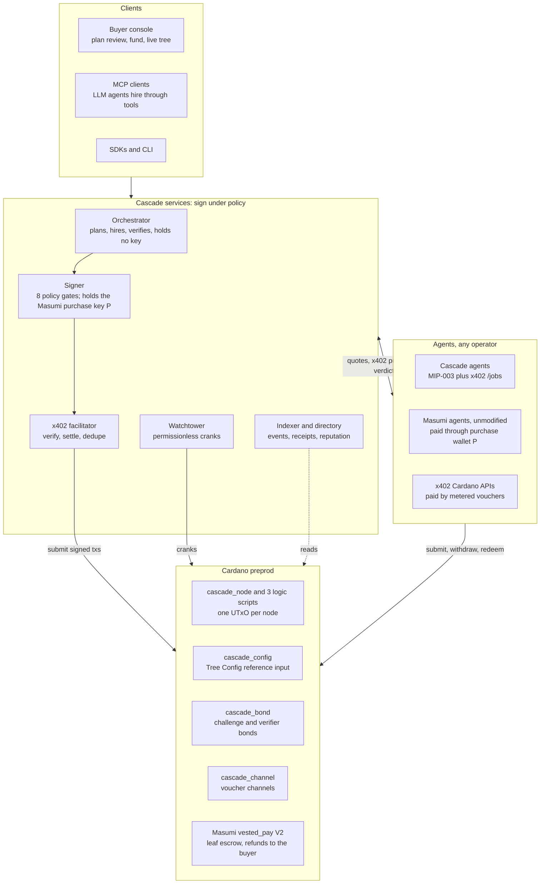

# Cascade

> **Timeline.** Cascade's design and early prototypes started on 2026-10-01, before the TOKEN2049 Origins hackathon. As agreed with the Cardano DevRel team, this repository was created and every on-chain deployment (scripts, reference UTxOs, demo trees and the Sokosumi Coworker's paid Tasks) was made during the hackathon window, 6 to 8 October 2026.


Escrow trees for the agent supply chain on Cardano. The buyer pays once. Every agent down the chain is paid only for verified work. Failed work refunds up the tree.

## For judges: quickstart

Cascade is a Sokosumi Coworker that turns one Task into a tree of hired AI agents, each paid from its own escrow on Cardano preprod.
It is the missing layer on top of Masumi and x402: a committed plan, validator-checked child escrows, a verifier quorum and refunds up the tree.

**Try it on Sokosumi in 3 steps**

1. In the Sokosumi preprod TOKEN2049 workspace, open the Coworker **Cascade Coworker** (ID `01a110cd-4ee0-763b-ae63-4008564c9f8e`).
2. Create a Task with a goal, for example "Compare the prices of three running shoe brands in Singapore and write a one-page brief", and pay with Sokosumi credits. Sokosumi locks the payment in Masumi escrow.
3. Wait for the Task to complete. Its result holds the deliverable, links to the live tree and receipt on https://cascade-alpha-amber.vercel.app, and a table of every agent hired, what each was paid and the preprod transaction that paid it.

| Link | URL |
| --- | --- |
| Live site | https://cascade-alpha-amber.vercel.app |
| Deployed Coworker | https://caenogenetic-varnishy-shaunte.ngrok-free.dev/cascade-coworker |
| Coworker code | [agents/cascade-coworker/](agents/cascade-coworker/) |
| Submission write-up | [docs/submission/builderbase.md](docs/submission/builderbase.md) |
| Agent directory | https://cascade-alpha-amber.vercel.app/api/v1/agents |

| Proof | Link |
| --- | --- |
| Sample completed Sokosumi Task | `{{SOKOSUMI_TASK_ID}}` (see [docs/sokosumi-coworker.md](docs/sokosumi-coworker.md)) |
| Seller payment receipt | `{{SOKOSUMI_RECEIPT}}` |
| Masumi escrow for that Task | `{{MASUMI_LOCK_TX}}` on preprod Cardanoscan |
| Coworker's Masumi registration | [27f2aa49f924...](https://preprod.cardanoscan.io/transaction/27f2aa49f9245d826b1837745d2a54d247f857ced77a7a2ef36856da7b8906a3) |
| Every escrow-tree redeemer on preprod | [table below](#every-redeemer-on-preprod) |
| Failed agent refunded into its parent | [fb8280c71a52...](https://preprod.cardanoscan.io/transaction/fb8280c71a523c5d423af87edc355f191feea126ba1e1722d514e66a279d6472) |

## What Cascade is

A buyer locks one budget in a root escrow on Cardano. A prime agent, the Conductor, splits that budget into child escrows for the agents it hires, and those agents can hire their own sub-agents the same way. Every node of the tree is its own UTxO with its own thread token, budget, deadlines and acceptance rule.

The validators decide where money moves. A child can never hold more than its parent drew for it. A parent cannot submit while a child is open. A child node's deadlines always end before its parent's. When an agent misses its deadline, anyone can crank a refund that returns its whole value into the parent, where it is spent on a replacement. When the root closes, the buyer gets back every unused lovelace.

Cascade plugs into what already exists. Agents quote and pay each other with x402 on Cardano. Any unmodified Masumi agent can be hired through its normal MIP-003 flow: the tree pays a dedicated Masumi purchase wallet, which makes a plain lock in Masumi's own `vested_pay` contract with every refund going to the buyer. Cheap tool calls run through voucher channels with a few L1 transactions. LLM agents can hire through the Cascade MCP server.

## Architecture



The full design is in [docs/PRD.md](docs/PRD.md) (sections 6 to 13) and the frozen on-chain interface in [docs/adr/0001-onchain-design.md](docs/adr/0001-onchain-design.md).

## Live on preprod

| What | URL |
| --- | --- |
| Buyer console | https://cascade-alpha-amber.vercel.app/console |
| Tree Explorer (public, per tree) | https://cascade-alpha-amber.vercel.app/tree/{tree_id} |
| Receipt (public, per tree) | https://cascade-alpha-amber.vercel.app/receipt/{tree_id} |
| Directory API | https://cascade-alpha-amber.vercel.app/api/v1/agents |
| Ops status | https://cascade-alpha-amber.vercel.app/api/v1/ops/status |
| Reference agents (MIP-003) | https://caenogenetic-varnishy-shaunte.ngrok-free.dev/{agent}, for example [/lisan/availability](https://caenogenetic-varnishy-shaunte.ngrok-free.dev/lisan/availability) |

The redeemer showcase tree below is public: [Tree Explorer](https://cascade-alpha-amber.vercel.app/tree/ade682cb5f8e007cb68584a35f8696b78f36d4c32b29fdda7cfad206) and [receipt](https://cascade-alpha-amber.vercel.app/receipt/ade682cb5f8e007cb68584a35f8696b78f36d4c32b29fdda7cfad206). The recorded demo tree is linked from `demo/out/cascade-demo.json` once the final recording runs.

## Deployed scripts

Aiken `v1.1.24+bacbeb3`, Plutus V3. Blueprint `contracts/plutus.json`, SHA-256 `0452fa1f0fbbbfd61f74d3c394a025429fe735187db19b30c2ae33fb167dbb51`. Deployed 2026-10-06 11:52 UTC. Every script is a reference script at an address no key can spend. Source: [deployments/preprod.json](deployments/preprod.json).

| Script | Hash | Size | Reference UTxO |
| --- | --- | --- | --- |
| `cascade_node` | `1eea6bd1b08cf9a466eed7ca7a8d9ab53aa8ed1526ed3281b785ba07` | 1,013 B | [febaa2fe...#0](https://preprod.cardanoscan.io/transaction/febaa2fec5500e154998978058203725e9c49c8d3ccec0e3aeb535cb5f0d9aba) |
| `cascade_logic_core` | `98ac3c2a0ace0f95750bcc9a9a912ed23e0407a483397a6d056ac9f8` | 14,980 B | [57d93b79...#0](https://preprod.cardanoscan.io/transaction/57d93b791abe8e8906abeaf7f649008aa0f717210da8a0e645b2d65f3aa8b954) |
| `cascade_logic_draw` | `66dcfce908741d5bdfea7aad54ad8779785983be4c0838544aeb09e1` | 12,503 B | [0e1383bd...#0](https://preprod.cardanoscan.io/transaction/0e1383bd049e7038440d3ca3c475f261fb5af253606116fc0e0a70524f9ca66a) |
| `cascade_logic_ext` | `aaf22cdcc8c27a42328ec16c09a77bdebf8dcf27c7f49eb4d22b27d9` | 11,221 B | [d329ed62...#0](https://preprod.cardanoscan.io/transaction/d329ed6230743de4a2bae2a466ed09e22302926a72acabfdb93f4bece71b0aaa) |
| `cascade_config` | `71c7b6bab9332b7684b8995fb66d7021d508626d364fb2824abbc445` | 671 B | [efa55635...#0](https://preprod.cardanoscan.io/transaction/efa556352641877b4f3762acb3393635c0914c3d71569748d99c17f870643666) |
| `cascade_bond` | `c658bb48805bf32d2c6bb1dca7b13fbb3567a67a150d9fba6664245f` | 761 B | [2c03dd86...#0](https://preprod.cardanoscan.io/transaction/2c03dd8639715251576dad6b854abf7e27f3beb24765a172ca613c7b845afc62) |
| `cascade_channel` | `b6e93a267107e300194fbc6d836914aa10239eee2f32a9ea427cd071` | 1,883 B | [d479322a...#0](https://preprod.cardanoscan.io/transaction/d479322a5f7756b0eb8036f2b1c84353905344d62bb0626460dfef7f0c701555) |

The three logic scripts are withdraw-zero stake validators. Their stake credentials are registered: core [eb10fdec...](https://preprod.cardanoscan.io/transaction/eb10fdec1b8766b1106a2c9542941d97f43b03dacb7f0795c77ec24f5c6f4072), draw [30c77138...](https://preprod.cardanoscan.io/transaction/30c77138f3c795dbd4218ab030ed57d462f14c38152fd70aec2c279054814fd1), ext [5513ef99...](https://preprod.cardanoscan.io/transaction/5513ef9920d9dd7d2dd4cc2f5753e5d9154f1b8a7843aeb4f890429149e64b6a). Why seven scripts and not four: one script with all the logic compiled to 23,286 bytes, above the 16,384-byte transaction limit (ADR 0001 sections 1.3 and 1.4).

## Every redeemer on preprod

Each PRD 7.5 redeemer (plus Escalate from ADR 0001) ran on the current deployment in one scripted run, [demo/redeemers.ts](demo/redeemers.ts). Every transaction was read back from Blockfrost and its Cascade redeemer decoded from the on-chain withdraw redeemer before it was written here. Full table with supporting transactions: [demo/out/redeemers.md](demo/out/redeemers.md).

Main tree `ade682cb5f8e007cb68584a35f8696b78f36d4c32b29fdda7cfad206`, spare tree `c157c001c156fc4c8134d89881434068dc521513e6053149c19959c4`, channel tree `5c3853de51dc8e173b922fea46e46192d1e7f6df6f06a8a70f146165`. Run on 2026-10-06 against the deployment above. Lovelace budgets of a few ADA.

| Redeemer | Preprod transaction | What it proved |
| --- | --- | --- |
| FundRoot | [a4d28ac98a37...](https://preprod.cardanoscan.io/transaction/a4d28ac98a371dd43eadf8cef3ca2c6f417dd07bc05e90a2ce48d5c402708cdf) | Buyer locks 20 ADA plus 24 ADA structural reserve; root and config thread tokens minted from a one-shot seed; plan root set. |
| TopUp | [ee128e5a67ea...](https://preprod.cardanoscan.io/transaction/ee128e5a67ea46d4f64e13a256b7d112bba069723eb4d1978b69d9d750f8c54a) | Buyer raises the root budget by 1 ADA; nothing else in the datum changes. |
| Freeze | [a5cb0366affa...](https://preprod.cardanoscan.io/transaction/a5cb0366affa6e4bd45d41b1f6eec9f5a6b925d07da98af065b8786d47b5370a) | Buyer sets frozen on the root; no value moves. Acceptance test A13 checks that a Draw fails while frozen. |
| Unfreeze | [d96f602ad290...](https://preprod.cardanoscan.io/transaction/d96f602ad290cdb85cc3435d555adbc35419f6d150af397533a04a2a582e0e40) | Buyer clears frozen; Draws are allowed again. |
| Draw (native) | [21514966fb1f...](https://preprod.cardanoscan.io/transaction/21514966fb1f80d33ee8037c6f74b33e9a3add9ff9ccf5d9744ebba9ed28eec9) | Conductor draws Scout, Pricer and Flaky Lisan as native children: three child tokens minted, each spec proven against plan_root, deadlines nested inside the root. |
| Draw (receipt) | [fb9bab1e94b9...](https://preprod.cardanoscan.io/transaction/fb9bab1e94b957010bf332c4ade622d16add47911e5e7ac4be96e0f2a70918ae) | Conductor draws a Metered receipt (voucher channel to the Lookup API, channel token minted) and a Masumi receipt (vested_pay V2 lock at the canonical Masumi script) in one transaction. |
| Submit | [ae62495eb1dd...](https://preprod.cardanoscan.io/transaction/ae62495eb1dde7be1ef1ff444efe1e25cd69638f2831984e5bf86496d36decfd) | Scout commits its result hash before submit_by with no open children. |
| Accept | [e3d8013ea393...](https://preprod.cardanoscan.io/transaction/e3d8013ea393b1487aaebd72aa2204ddf26ff56bd39ffcb94014e03ce6a8eb47) | The parent operator's signature satisfies Scout's ParentAccept rule. |
| SettleChild | [da37ee899e39...](https://preprod.cardanoscan.io/transaction/da37ee899e391eb1d515bc187f04b7a6ae2c177d094c13ca4a51fe3ea95aae4f) | Scout's 1 ADA fee goes to its payee, the unused 2 ADA folds back into the root, the child token burns (withdraw-zero settlement). |
| Challenge | [d784c8354210...](https://preprod.cardanoscan.io/transaction/d784c83542101a7ce7947fd82ff5389f65822dce11abdf918e8b03dda53bc480) | The parent operator challenges Pricer's submitted result before challenge_until and posts a 4 ADA bond at cascade_bond (the treasury pays it; the operator key signs). |
| Escalate | [3a45f8f2af4c...](https://preprod.cardanoscan.io/transaction/3a45f8f2af4c0ca6a4e1adfec716a487a403f24ae1374bda8023807dbd1746bb) | Pricer, the challenged worker, escalates to the arbiters before dispute_until. |
| Resolve | [baf314d8b9d6...](https://preprod.cardanoscan.io/transaction/baf314d8b9d6f363ca021bef105fab3d2008cf0febb4837fc001c02adbc742f2) | Arbiters 1 and 2 (threshold 2) split Pricer's 3 ADA: 1.5 ADA to the worker, 1.5 ADA back into the root. The challenger's bond is slashed 70/30: 2.8 ADA to the worker, 1.2 ADA to the arbiter fee address. |
| Refund | [fb8280c71a52...](https://preprod.cardanoscan.io/transaction/fb8280c71a523c5d423af87edc355f191feea126ba1e1722d514e66a279d6472) | Flaky Lisan, a test agent that fails on purpose, missed submit_by. After refund_after anyone may crank Refund; its whole value returns into the root in one transaction. |
| CloseReceipt (Metered) | [1db9f3114927...](https://preprod.cardanoscan.io/transaction/1db9f31149273c8096ef33708e50deadd3a5757bde58fe3916ad5685deebec48) | Operator and provider close the metered receipt before any redeem: the whole 3 ADA deposit returns from the channel into the root; channel and receipt tokens burn. |
| CloseReceipt (Masumi) | [2f419757cafd...](https://preprod.cardanoscan.io/transaction/2f419757cafdfaa2e6da23968d2bc55dcc0c9428db2fe16c9098df744e270182) | After the Masumi lock refunded to buyer_refund, the operator closes the Masumi receipt; parent counters drop and the receipt token burns. |
| CloseRoot | [69720f316230...](https://preprod.cardanoscan.io/transaction/69720f3162300f9b04febd20723a5f3d51135504c3b5d62f404fcc1b9dbc9df0) | Buyer accepted the root; the Conductor gets its 1 ADA fee, everything else (unused budget and all structural ADA) returns to buyer_refund, root and config tokens burn. |
| Cancel | [232d2d8f8cf1...](https://preprod.cardanoscan.io/transaction/232d2d8f8cf11e57d67f084bc5aa45d5403172c3d999f25bc57140272986d414) | Buyer cancels a funded tree with nothing drawn: full refund, both tokens burn. |

The Masumi rows use the on-chain `MasumiReceipt` kind: the Draw itself locks into the real `vested_pay` V2 script. Its seller is a test key with short deadlines so the refund ([a789a7acd633...](https://preprod.cardanoscan.io/transaction/a789a7acd6338b3d8e95b10a3858c23baa63b19d6541b8430c8cee55be61da90)) runs in minutes. Unmodified Masumi sellers cannot use this path today (see Limitations, B6); they are hired through the purchase wallet path of ADR 0001 section 8.1, which is acceptance tests A3 and A4. A provider `Redeem` of a voucher channel, on a third tree: [2961fe2fbabc...](https://preprod.cardanoscan.io/transaction/2961fe2fbabcf4ab94ecb69d6991255ebfc2780780d09823f559eb269cce516c).

## Run it

Requirements: Node 20 or later, pnpm 12, Docker, [Aiken v1.1.24](https://aiken-lang.org), and for the deck [uv](https://docs.astral.sh/uv/). Secrets go in a git-ignored `.env` at the repo root: `CASCADE_TREASURY_MNEMONIC` (preprod only), `BLOCKFROST_PROJECT_ID_PREPROD`, `DATABASE_URL_PREPROD`, `OPENROUTER_API_KEY`. Never use a mainnet key.

```bash
pnpm install
pnpm aiken:check             # validator unit and property tests
pnpm local:up                # Yaci DevKit, Postgres, Temporal, services, agents and web app on one machine
pnpm verify:all              # build, aiken, unit, integration, adversarial, A1 to A20 on preprod, e2e, public URLs
pnpm local:down
```

`pnpm verify:all` is the only writer of [test-results.json](test-results.json).

Demo material (all from `demo/`):

```bash
scripts/heavy.sh pnpm --filter @cascade/demo redeemers           # every PRD 7.5 redeemer on preprod, about 25 min, resumable
scripts/heavy.sh pnpm --filter @cascade/demo web-local -- --build-only # optional: build apps/web at HEAD with the preprod config
pnpm --filter @cascade/demo web-local -- --no-build               # optional: serve it on http://localhost:3100
scripts/heavy.sh pnpm --filter @cascade/demo record -- --stage --dry-run # check the recording pipeline, no money moves
scripts/heavy.sh pnpm --filter @cascade/demo record -- --stage    # the PRD 21.2 flow on preprod -> demo/out/cascade-demo.mp4
scripts/heavy.sh pnpm --filter @cascade/demo shots                # deck screenshots of the recorded tree
cd demo && uv run deck.py                                         # demo/out/cascade-deck.pptx, video embedded in slide 4
```

The recording drives the console with a CIP-30 test wallet injected into the page. It signs as the `demo-buyer` account (index 23), so it never competes with `pnpm verify:all` for the buyer's UTxOs. `CASCADE_DEMO_WEB_URL` points `record` and `shots` at a local build; the deployed site is the default. The key stays in the Node process that runs Playwright and is never sent to the page or logged.

## Test report

| Report | What it holds |
| --- | --- |
| `aiken check` | 735 tests (672 unit, 63 property), 0 failures, 6,972 checks at commit 86cb9a1 ([demo/out/aiken-check.json](demo/out/aiken-check.json)). |
| [test-results.json](test-results.json) | Pass or fail for acceptance tests A1 to A20, the evidence path and the commit each ran on. Written only by `pnpm verify:all`; this file is the source of truth for acceptance status. |
| [evidence/](evidence/) | One `result.json` per acceptance test: assertions, every transaction with its Cardanoscan link, notes. |
| [security/review-report.md](security/review-report.md) | Validator review: the contract audit trail: every audit (F1 to F5) and evaluator (E1 to E14) finding with its fix and regression tests. |
| [security/audit-2026-10-01-21f7228.md](security/audit-2026-10-01-21f7228.md), [security/re-review-2026-10-01-814cc42.md](security/re-review-2026-10-01-814cc42.md) | Independent audit of the contracts and its re-review. |
| [security/threat-model.md](security/threat-model.md) | Trust assumptions, threats T1 to T19 with their on-chain checks and tests, invariants mapped to tests. |
| [tests/adversarial/](tests/adversarial/) | Mutated transactions per redeemer, each submitted to a real node. [report.json](tests/adversarial/report.json) lists every case and the count of unexpected successes, which must be 0. |
| [demo/out/redeemers.json](demo/out/redeemers.json) | The redeemer showcase above, with block heights and decoded on-chain redeemers. |

## Limitations

- **Masumi purchase wallet `P` holds funds briefly.** Unmodified Masumi sellers are hired through ADR 0001 section 8.1: an `AddressPayment` Draw pays the lock amount to a dedicated purchase wallet `P` (bound in the buyer-signed plan, never the operator key), and `P` then makes a plain `vested_pay` lock whose refunds go only to the tree's `buyer_refund`. The signer holds `P`'s key and signs for it only that lock, refunds on such a lock, or a return of exactly the received amount to `buyer_refund`. Custody lasts from the Draw to the lock, normally one block. A compromised signer could take in-flight Masumi payments held by `P`; funds already locked can only go to the seller on delivery or to `buyer_refund`, enforced by `vested_pay`. The watchtower requests and withdraws Masumi refunds for failed leaves without the Conductor.
- **Masumi refunds depend on Cascade services for liveness, not safety.** A failed Masumi leaf is refunded to the buyer without the Conductor: Cascade's watchtower sees the purchase wallet's lock past its result deadline with no result (or a payment it never locked) and asks Cascade's signer to sign as the purchase wallet, which signs only a full refund or return to the tree's `buyer_refund`. Liveness depends on the signer, the watchtower and the purchase wallet holding a little ADA for fees; safety does not: if either service is down, funds wait in the escrow or at the purchase wallet, and the signer cannot send them anywhere but the buyer.
- **B6: the trustless Masumi receipt is unusable with unmodified sellers.** The Masumi Payment Service classifies any lock created in a transaction with redeemers as invalid and skips it, and a Cascade Draw always carries redeemers. So a lock made by a `MasumiReceipt` Draw is never seen by the seller. The on-chain `MasumiReceipt` kind stays in the contracts (it is the one in the redeemer table) for when Masumi accepts script-created locks ([BLOCKERS.md](BLOCKERS.md) B6).
- **Masumi deadlines are not nested.** On the purchase wallet path the Masumi leaf has no tree node, so its deadlines are not checked against the parent's window (a deviation from PRD 7.7). The tree may close before the Masumi escrow resolves; refunds still go to `buyer_refund`. The receipt line tracks the lock, its `blockchainIdentifier` and the outcome.
- **A4 runs in two phases.** The unmodified template fixes `submit_result_time` 24 hours after a job starts, and Masumi allows a refund only after it. So the Masumi refund test locks and requests the refund first, and withdraws at least 24 hours later ([DECISIONS.md](DECISIONS.md)).
- **Lisan shim, two changes.** Lisan runs the crewai-masumi-quickstart-template with its code unmodified. A disclosed shim between the template and its payment service (1) rewrites the payment-source fields of `POST /payment`, because the template's library requests a V1 source and the service has only V2, and (2) adds `filterPaymentSourceType=Web3CardanoV2` to the library's payment-list poll, without which the agent never sees it was paid. The shim is disclosed in the agent's README and on the receipt.
- **Lisan dependency pin.** The template's Python dependencies are pinned to the template's own commit date (crewai 1.6.1, masumi 0.1.41) in `agents/lisan-masumi/requirements.lock`, because newer releases break the unmodified template.
- **Test agents.** Flaky Lisan and Lisan-B are test agents that fail on purpose, to show refunds. They are labelled as test agents in the registry, the UI and the recording.
- **Deterministic LLM fallback.** Product LLM calls go through OpenRouter with a 3 USD spend cap. When the cap is near or a provider is down, agents switch to a deterministic fallback, labelled "deterministic fallback, no LLM" in results, UI and evidence. Chain behaviour is the same either way.
- **Preprod budgets are in ADA.** The treasury holds no preprod tUSDM, so preprod trees are funded in lovelace. The 6-decimal token path is tested on the local devnet.
- **Hosting.** Services and agents run on the operator's machine behind one ngrok domain; the web app runs on Vercel and reads the indexer's Postgres. Agent URLs are stable while that machine runs.
- **Subbit.** Metered leaves use Cascade's own `cascade_channel` validator, which keeps Subbit's cumulative-voucher model but constrains every close output (Subbit's published close path does not).

## Repository

| Path | What |
| --- | --- |
| `contracts/` | Aiken validators, property tests, blueprint |
| `packages/` | `shared` (codecs, Merkle, COSE), `sdk` (tree client and transaction builders), `x402`, `agent`, `orchestrator`, `policy` (signer gates), `mcp`, `cli` |
| `services/` | indexer, facilitator, signer, watchtower, service runner |
| `agents/` | Conductor, Scout, Pricer, Lookup API, Scribe, Checkers, Flaky Lisan, Lisan (Masumi template) |
| `apps/web` | buyer console, Tree Explorer, receipts, provider, arbiter and ops pages |
| `tests/` | acceptance A1 to A20, integration, adversarial, e2e, chaos, load |
| `demo/` | redeemer showcase, recording, deck |
| `docs/` | PRD, ADRs, research notes, submission write-ups |

## Licence

Apache-2.0. See [LICENSE](LICENSE). Third-party code and libraries are listed in [THIRD_PARTY.md](THIRD_PARTY.md).
