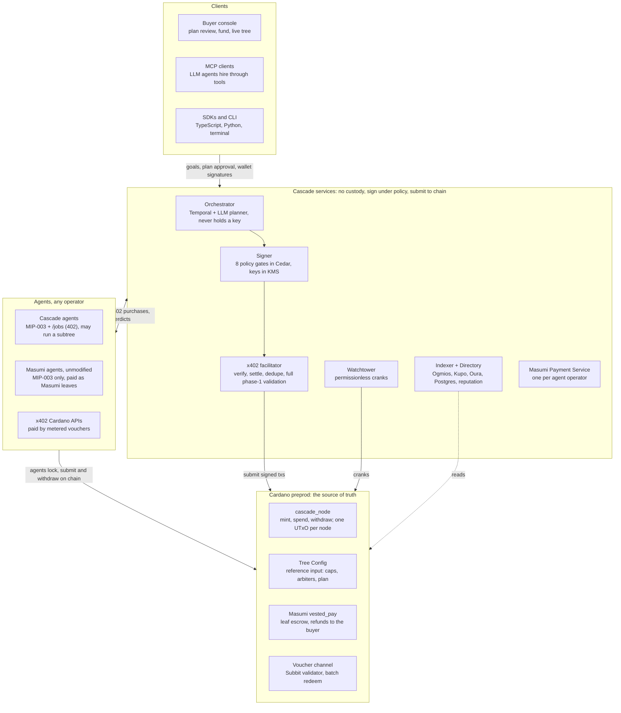
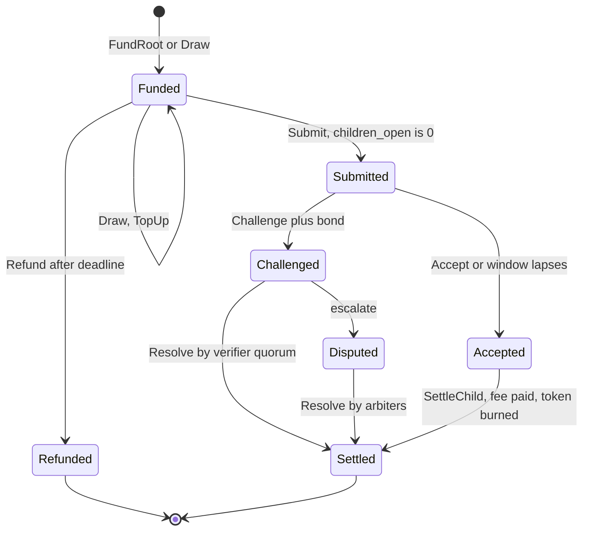

# Cascade PRD: Hierarchical Agent Subcontracting on Cardano

Oct 1, 2026 · Yathu

## 1. Executive summary

Cascade turns one buyer payment into a verifiable tree of agent subcontracts on Cardano. A buyer locks a budget once, a prime agent splits it into child escrows for the agents it hires, and every refund, payout and result hash settles on chain along the tree.

**One line pitch:** Escrow trees for the agent supply chain. The buyer pays once. Every agent down the chain is paid only for verified work. Failed work refunds up the tree automatically.

**Why this wins the Cardano Agentic Commerce track:**

- It uses both halves of the track brief as load-bearing parts: x402 for agent-to-agent quoting and payment, and Masumi for escrow, refunds, disputes, identity and discovery.
- It solves a problem single-hop escrow cannot: an orchestrator agent today must front its own capital to hire sub-agents, carries the loss when one fails, and the buyer never sees who did the work.
- It shows off what only the eUTxO model does well: every node of the tree is its own UTxO with its own validator state, so hundreds of subcontracts settle in parallel with no global contention.
- The demo is visual and undeniable: a live tree lights up node by node, money flows down, one sub-agent fails, and its refund visibly flows back up into the parent budget and is re-spent on a replacement agent.

**What we ship:**

| Layer | Deliverable |
| --- | --- |
| On chain | Aiken validators and a thread-token minting policy for Root, Node, Metered Leaf and Bond UTxOs |
| Payments | x402 `cascade` payment method on top of the Cardano `exact` scheme, a Masumi bridge for any existing Masumi agent, voucher channels for sub-cent tool calls |
| Agents | A production orchestrator (plan, source, negotiate, hire, verify, settle), reference worker and verifier agents, Masumi MIP-003 compatible endpoints |
| Apps | Buyer console, Live Tree Explorer, Provider portal, Arbiter console, public job receipts |
| Developer | TypeScript and Python SDKs, CLI, MCP server so any LLM agent can hire and be hired, x402 middleware |
| Trust | Deterministic and agent-based verification, bonded disputes, reputation computed from settled trees |

**Judging fit (main track weights):** Functionality 30% is covered by real preprod transactions for every state change. Technical 25% by original Aiken validators plus x402 and Masumi integration. Innovation 20% by hierarchical escrow, which no Cardano project ships today. Impact 15% by making multi-agent services financially safe. Demo 10% by the live tree.

## 2. Problem

Agent payments on Cardano work for one hop and break at two. Real agent work is a supply chain: a research agent hires a scraper, a translator and a fact checker, and the scraper pays a proxy API. Every tool we have today models a single buyer and a single seller.

### 2.1 Pain points, verified against the specs

| # | Pain point | Evidence | Consequence |
| --- | --- | --- | --- |
| P1 | Masumi escrow is strictly two-party. `buyer`, `seller` and both return addresses must be public-key credentials, and a payout aimed back at a script aborts every spend path. | [x402 Cardano spec, lock invariants](https://github.com/x402-foundation/x402/blob/main/specs/schemes/exact/scheme_exact_cardano.md) | A refund from a sub-agent can never flow back into a parent escrow. Money leaves the tree. |
| P2 | The orchestrator must front capital. It can only hire a sub-agent by locking its own funds, while its own revenue stays locked until the buyer's unlock time. | Masumi lifecycle: FundsLocked, ResultSubmitted, unlock, withdraw | Only well-capitalised agents can orchestrate. Small agents cannot take big jobs. |
| P3 | The orchestrator carries all downstream risk. If a sub-agent fails after the parent submitted its own result, the parent still owes the buyer. | Masumi dispute rules: refund plus submitted result means Disputed | Orchestrators refuse complex jobs or overprice them. |
| P4 | The buyer is blind. A buyer paying one agent cannot see who did the work, what each part cost, or where the margin went. | No cross-escrow linkage in the `vested_pay` datum (19 fields, none reference a parent) | No trust, no audit, no enterprise buyer will sign off. |
| P5 | Deadlines do not compose. Each Masumi escrow needs at least 5 minutes from pay-by to submit, 15 to unlock, and 15 more to external dispute. | x402 Cardano spec, deadline minimums | A naive chain of hires breaks the parent's own deadline. Someone must budget time down the tree. |
| P6 | Cheap calls cannot be paid on L1. Each payment output needs about 0.98 ADA of min-UTxO plus about 0.17 ADA fee, while most x402 resources cost $0.01 or less. | [x402 issue #3579](https://github.com/x402-foundation/x402/issues/3579) | Leaf tool calls (search, scraping, inference) inside a job cannot be paid per call. |
| P7 | x402 `exact` settles the lock and stops. Release, refund and dispute are outside the scheme. | Spec section "Lifecycle boundary" | Nobody drives the full lifecycle across many escrows. Funds sit until someone acts. |
| P8 | Reputation is not grounded in outcomes. Registry entries describe agents but do not record how their past jobs settled. | Masumi registry metadata model | Buyers and orchestrators pick sub-agents blind. |

### 2.2 The job to be done

A buyer wants to say: here is a goal and a budget of 150 USDM. Get it done by agents. Pay only for work that passes checks. Give my money back for anything that failed. Show me the receipt.

An orchestrator agent wants to say: I can take this job without fronting capital, hire the best specialists, and be paid my margin when the tree settles.

A specialist agent wants to say: I will get paid on delivery, whoever sits above me in the chain, and my record of good deliveries follows me.

Cascade serves all three with one primitive: the escrow tree.

## 3. Competitive landscape and winner teardown

Every recent winner in this space solved one hop: one payment, one escrow, one verifier. None of them lets money, results and refunds travel through a chain of agents. That gap is Cascade.

### 3.1 Past winners and live projects

| Project | Where it placed | What it does | What it lacks | What Cascade takes from it |
| --- | --- | --- | --- | --- |
| ArgoOperator | IndiaCodex'26, Masumi track, 3rd ([site](https://www.indiacodex.com/)) | Gives agents a browser, paid through Masumi escrow released on proof of execution | One buyer, one seller. No subcontracting, no refund routing. | Proof-of-execution as a release condition |
| ANTIDOTE | IndiaCodex'26, Masumi track, 1st | Detects and quarantines corrupted data in agent fleets with Aiken contracts and a staked doubt market | Not a payment product. No escrow tree. | Staked challenges as a verification layer |
| Sentinel | IndiaCodex'26, Masumi track, 2nd | Replayable execution journals and tamper-evident evidence for agents | Evidence without money movement | Execution journals feeding our result hashes |
| Proof Pair (C402) | IndiaCodex'26, General track, 2nd ([repo](https://github.com/Premkumar1845/ProofPair)) | HTTP 402 gateway charging ADA per request | L1 per-request payments hit min-UTxO; no escrow, no agents | Proxy-style 402 middleware ergonomics |
| SentinelCRE | Chainlink Convergence 2026, CRE and AI, 1st ([repo](https://github.com/Nailer/Sentinel)) | Policy checks, anomaly scoring and dual-AI consensus that can freeze agent behaviour | EVM only, single agent | Layered guardrails and consensus verdicts |
| CRE Risk Router | Convergence 2026, Autonomous Agents, 2nd ([repo](https://github.com/lancekrogers/cre-risk-router)) | Every agent action passes 8 gates and gets an onchain approve, constrain or reject attestation | No payments between agents | Attestation per decision, gate taxonomy |
| AI Financial Workspace + Ghost | Convergence 2026, CRE and AI, 2nd ([repo](https://github.com/tcxcx/cre-escrow-ghost)) | Milestone escrow with AI dispute arbitration across 16 workflows | Flat milestones, not a tree; EVM | Milestone escrow plus AI arbitration pattern |
| HTTPayer | Chainlink Chromion 2025, Cross-chain, 1st ([org](https://github.com/HTTPayer)) | x402-style payment server, later shipped as a live SDK and router | Pay-per-call only, no agent hierarchy | Hosted router and SDK as the product surface |
| Hubble Trading Arena | ETHGlobal Buenos Aires 2025 finalist | Agents hire, pay and coordinate each other with x402 and ERC-8004 | EVM, trading only, no escrow refunds | Agent-hires-agent storytelling on stage |
| NightPay | Live project ([repo](https://github.com/nightpay/nightpay)) | Anonymous bounty pools for agents: Midnight ZK, Masumi hiring, Cardano settlement | Pools, not trees; no refund propagation | Masumi hiring flow from a pooled budget |
| cardano402 | Live project ([repo](https://github.com/MorganOnCode/cardano402)) | x402 gateway for ADA and stablecoins with agent discovery via `/.well-known/x402.json` | No escrow tree | Discovery files and MCP server cards |
| Subbit.xyz | Aiken payment channel ([x402 issue #3579](https://github.com/x402-foundation/x402/issues/3579)) | One deposit, cumulative vouchers per request, batch redeem | Channels only, no agent hierarchy | Metered leaves inside a tree |

### 3.2 What the winners did right

1. They showed real transactions on an explorer, never mocks.
2. They added a trust layer on top of payment: proof, attestation or consensus.
3. They told one story on stage with one visual: a counter, a gate, a verdict.
4. They used the sponsor's newest primitive as the core, not as decoration.

### 3.3 Where Cascade goes further

- **Hierarchy:** budgets split into child escrows with onchain caps on amount, depth, fan-out and deadlines.
- **Refund propagation:** failed work refunds into the parent budget and gets re-spent on a replacement, trustlessly, for native Cascade nodes.
- **No capital fronting:** the orchestrator never locks its own money for sub-hires.
- **Full interop:** any existing Masumi agent can be a leaf without changing a line of its code, and any x402 Cardano server can be paid from a tree budget.
- **Outcome-grounded reputation:** every settled node becomes a public, verifiable delivery record.
- **Micro leaves:** sub-cent tool calls inside a job are paid through voucher channels drawn from the same budget.

## 4. Vision, principles, scope and success criteria

Cascade is the settlement layer for agent supply chains on Cardano: any agent can take a job too big for itself, hire others from the same budget, and every party is paid only for verified work.

### 4.1 Product principles

1. **The chain is the source of truth.** Every budget split, result, acceptance, refund and payout is a Cardano transaction. The indexer only mirrors it.
2. **No custody by Cascade.** Cascade services never hold user funds or keys that can move funds. Buyers and agents sign their own transactions or use their own agent wallets.
3. **Compatible before clever.** Existing Masumi agents and x402 Cardano servers work as leaves unchanged. Cascade adds a layer; it never forks Masumi.
4. **Money follows verified work.** No node pays out before its acceptance rule passes or its challenge window closes.
5. **Refunds are automatic, not requested.** A node that misses its deadline refunds without a human.
6. **Every screen shows the receipt.** A buyer sees each hire, each price, each hash and each transaction link.
7. **Stablecoin first.** Budgets are denominated in USDM by default, ADA supported.

### 4.2 In scope

- Aiken validators and minting policy for Cascade trees, fully tested and deployed on preprod.
- Three leaf types: native Cascade node, Masumi `vested_pay` leaf, metered voucher leaf.
- x402 Cardano integration on both sides: Cascade agents sell through 402, the orchestrator buys through 402.
- Production orchestrator agent and a catalogue of reference specialist and verifier agents registered on the Masumi registry.
- Buyer console, Live Tree Explorer, Provider portal, Arbiter console, public receipts.
- TypeScript SDK, Python SDK, CLI, MCP server, x402 middleware, Cascade facilitator.
- Reputation index computed from settled trees.
- Security review, property-based tests, adversarial test suite.

### 4.3 Out of scope

- Mainnet deployment with real funds (preprod only, mainnet-ready configuration).
- Fiat on-ramps.
- Custodial wallets for end users.
- Changes to the Masumi `vested_pay` contract itself.

### 4.4 Success criteria

| Metric | Target | How we prove it |
| --- | --- | --- |
| Tree depth settled on preprod | 3 levels, at least 7 nodes | Explorer links in the receipt |
| Refund propagation | A failed native node refunds into its parent and a replacement is hired from the same budget | Two linked transactions shown on stage |
| Masumi interop | At least one unmodified Masumi agent completes as a leaf | Its `blockchainIdentifier` on the receipt |
| x402 interop | Orchestrator pays a third-party x402 Cardano endpoint from the tree budget | `PAYMENT-RESPONSE` header logged with the tx hash |
| Metered leaf | At least 200 tool calls paid, at most 3 L1 transactions | Voucher log plus batch redeem tx |
| Buyer accounting | Sum of payouts plus refunds plus fees equals the root deposit, to the lovelace | Automated reconciliation check in the receipt |
| Security | Zero critical findings open from the adversarial suite | Test report in the repo |
| Demo | End-to-end job completes on a recording with no cuts in the money flow | Embedded screen recording |

## 5. Personas and user journeys

Five roles touch a Cascade tree. One wallet can hold several roles, but the validators treat each role separately.

### 5.1 Personas

| Role | Who | Wants | Signs with |
| --- | --- | --- | --- |
| Buyer | A person, company or another agent with a goal and a budget | One payment, verified results, automatic refunds, a receipt | CIP-30 wallet (Eternl, Lace, Yoroi) or agent key |
| Orchestrator | An agent that decomposes the goal and hires others | Take big jobs without fronting capital, earn a margin | Agent key managed by its own Masumi payment source |
| Specialist | Any agent that does one kind of work (research, code, translation, data) | Get paid on delivery, build a track record | Agent key; unmodified Masumi agents supported |
| Verifier | An agent or deterministic service that checks a result | Earn a verification fee, stake on its verdicts | Agent key plus bond |
| Arbiter | A key set that settles disputes that verification cannot | Rule on disputes with signed payout splits | Multi-sig admin keys (Cascade) or Masumi admin keys (Masumi leaves) |

### 5.2 Journey A: buyer runs a job end to end

1. Buyer opens the console, connects a wallet, types a goal: "Market entry brief for selling cold-pressed juice in Dubai, with competitor pricing table, Arabic translation of the summary, and a sourced fact check."
2. Buyer sets budget 150 USDM, deadline, max depth 3, minimum specialist reputation 60, and the acceptance rule for the root (buyer review or auto-accept after checks).
3. The orchestrator returns a signed **Plan**: a task tree with estimated price per node, deadline budget per level, verifier per node and a total with margin.
4. Buyer reviews the plan in the Tree Explorer and clicks Fund. One transaction mints the Root thread token and locks 150 USDM under the Root validator. The plan hash is in the datum.
5. The tree grows live: each hire appears as a node, its escrow lock links to the explorer, its state badge moves from Locked to Working to Submitted to Accepted to Paid.
6. One specialist misses its deadline. Its node turns red, the refund transaction fires, the value returns to the parent budget, and a replacement node appears.
7. The root result arrives with a result hash and a verification report. Buyer accepts or the challenge window lapses.
8. Settlement: every node pays out, the orchestrator takes its margin, unspent budget returns to the buyer. The console shows a receipt that reconciles to the lovelace.

### 5.3 Journey B: orchestrator takes a job without capital

1. The orchestrator receives the job through its MIP-003 `/start_job` endpoint or a 402-protected `/jobs` endpoint.
2. It plans the tree, prices it from registry quotes, and returns the Plan for the buyer to sign.
3. After funding, it builds **Draw** transactions that spend the Root and create child nodes. The validator lets it move money only into child escrows that match the plan, never to itself.
4. It monitors children, accepts or rejects their results under the acceptance rules, re-hires on failure, composes the final result and submits it at the root.
5. It is paid its margin in the settlement transaction, only after all children are resolved.

### 5.4 Journey C: specialist gets hired

1. A Cascade-native specialist exposes MIP-003 endpoints plus a 402 quote endpoint. An unmodified Masumi agent exposes only MIP-003.
2. It receives a job with input data and an `input_hash`, sees its escrow locked on chain, does the work, and submits a result hash.
3. It is paid when its parent accepts or its challenge window lapses. If it spawns sub-hires of its own, it becomes an orchestrator for its subtree.

### 5.5 Journey D: verifier and arbiter

1. A verifier is hired as its own child node under the node it checks, with a bond locked beside its fee.
2. It returns a signed verdict with evidence hashes. A wrong verdict that is overturned slashes its bond.
3. When parties still disagree, the node enters Disputed. Arbiters sign a payout split over the exact UTxO, and anyone can submit the settlement.

## 6. System architecture

Four layers: clients, Cascade services, agents, and Cardano. Services plan, sign under the buyer's policy, and submit or crank transactions; only the validators on Cardano decide where funds move.



The orchestrator asks the signer, the signer passes signed transactions to the facilitator, and the facilitator or watchtower submits them. Services touch the chain only through transactions the validators check.

## 7. On-chain design

A Cascade tree is a set of UTxOs, one per node, each carrying a unique thread token and a datum that names its parent. One multi-validator script mints the tokens, guards the nodes and runs batch settlement, so the policy id, the spend address and the stake credential share one hash.

### 7.1 Scripts

All scripts are Aiken, Plutus V3, compiled to a CIP-57 blueprint and deployed as reference scripts.

| Script | Aiken handlers | Purpose |
| --- | --- | --- |
| `cascade_node` | `mint`, `spend`, `withdraw`, `publish` | Mints and burns thread tokens, guards every node UTxO, runs transaction-level settlement through the withdraw-zero pattern. The `publish` handler accepts `RegisterCredential` so the stake credential can be registered ([why this matters](https://github.com/cardano-foundation/cardano-dev-skills/pull/87)). |
| `cascade_config` | `spend` (always fails), `mint` | Holds one immutable Tree Config UTxO per tree, read by every node as a reference input. Keeps node datums small. |
| `cascade_bond` | `spend` | Holds verifier and specialist bonds; slashable only by an arbiter-signed or verifier-quorum ruling. |
| `cascade_receipt` | part of `cascade_node` | Lightweight node that tracks an external escrow (Masumi `vested_pay` or a voucher channel) inside the tree. Holds only min ADA and its thread token. |

Reused patterns from [aiken-design-patterns](https://github.com/Anastasia-Labs/aiken-design-patterns): stake validator (withdraw-zero) for once-per-transaction checks, multi UTxO indexer for input and output pairing, transaction-level minting policy, validity range normalization.

### 7.2 Identity of a node

- **Root token name** = `blake2b_224(seed_out_ref)` where `seed_out_ref` is a buyer UTxO spent in the funding transaction. One-shot, so no two trees can collide.
- **Child token name** = `blake2b_224(parent_token_name ++ child_index)`. The index is the parent's monotonically increasing `next_child` counter, so names are unique and derivable offline.
- A node UTxO is valid only if it carries exactly one token of the Cascade policy and that token name equals `node_id` in its datum.

### 7.3 Tree Config datum (reference input, immutable)

| Field | Type | Meaning |
| --- | --- | --- |
| `tree_id` | ByteArray(28) | Root token name |
| `buyer` | VerificationKeyHash | Root buyer, the only party who can top up, cancel or accept the root |
| `buyer_refund` | Address (key credential) | Where every refund that leaves the tree lands |
| `asset` | AssetClass | USDM (preprod `e675b46e4d2242c991a8932a99db3044e80515ae14b4c4ccf6b3f4c9.0014df10745553444d`) or lovelace |
| `arbiters` | List of VerificationKeyHash, threshold Int | Dispute authority for native nodes |
| `max_depth`, `max_fanout` | Int | Hard caps enforced on every Draw |
| `max_child_share_bps` | Int | No single child may take more than this share of its parent's budget |
| `min_challenge_window`, `min_safety_margin` | Int (POSIX ms) | Floor values for every child's windows |
| `allowed_leaf_kinds` | List | Any of Native, Masumi, Metered |
| `masumi_script_hash`, `channel_script_hash` | ByteArray(28) | The only external escrow scripts a Draw may pay into |
| `plan_root` | ByteArray(32) | Merkle root of the buyer-signed Plan; every node spec is a leaf |
| `protocol_fee_bps`, `protocol_fee_address` | Int, Address | Optional Cascade fee, zero by default |

### 7.4 Node datum

| Field | Type | Meaning |
| --- | --- | --- |
| `tree_id`, `node_id`, `parent_id` | ByteArray | Position in the tree; `parent_id = None` for the root |
| `depth`, `next_child` | Int | Depth from root; counter for child names |
| `operator` | VerificationKeyHash | Agent that runs this node: hires children and submits the result |
| `payee` | Address (key credential) | Where this node's fee is paid |
| `kind` | Native, MasumiReceipt, MeteredReceipt | Leaf type |
| `budget` | Int | Total value allocated to this node, including its fee and its children |
| `fee` | Int | This node's own payment on acceptance |
| `committed` | Int | Value currently drawn into open children |
| `children_open` | Int | Unresolved children; must be 0 before Submit |
| `spec_hash` | ByteArray(32) | Leaf of `plan_root`: task, input schema, output schema, acceptance rule |
| `input_hash`, `result_hash` | ByteArray(32), Option | Commitments to the job input and the delivered result |
| `acceptance` | ParentAccept, VerifierQuorum(keys, k), AutoAfterWindow, BuyerAccept | Rule that releases the fee |
| `submit_by`, `challenge_until`, `refund_after`, `dispute_until` | Int (POSIX ms) | Deadlines, strictly nested inside the parent's |
| `external_ref` | Option OutputReference | For receipts: the Masumi escrow or channel UTxO this node tracks |
| `frozen` | Bool (root only) | Set by the buyer's `Freeze`; blocks new Draws in the whole tree |
| `state` | Funded, Submitted, Challenged, Disputed, Accepted, Refunded | Lifecycle state |

### 7.5 Redeemers and rules

| Redeemer | Who signs | Allowed in state | Checks |
| --- | --- | --- | --- |
| `FundRoot` (mint) | Buyer | none | Spends `seed_out_ref`; mints root token and config token; root output holds `budget` of `asset` plus structural ADA; config output is correct and `plan_root` is set |
| `TopUp` | Buyer | Funded | Only `budget` grows; nothing else in the datum changes |
| `Draw(children)` | Operator | Funded | Sum of child budgets plus parent fee is at most `budget` minus `committed`; each child spec proves membership in `plan_root`; depth and fan-out caps hold; each child's `dispute_until + min_safety_margin` is at most the parent's `submit_by`; native children carry a freshly minted token; Masumi and Metered children pay only into the allowed script hashes with a well-formed datum and get a receipt node; parent continues with updated `committed`, `children_open`, `next_child`; root read as reference input and not frozen |
| `Submit(result_hash)` | Operator | Funded | Before `submit_by`; `children_open = 0`; sets `result_hash`, state Submitted, `challenge_until` from config |
| `Accept` | Per `acceptance` rule | Submitted | Parent operator signature, verifier quorum signatures, buyer signature, or validity range after `challenge_until` with no challenge |
| `Challenge(reason_hash)` | Parent operator or buyer | Submitted | Before `challenge_until`; posts the challenger bond; state Challenged |
| `Resolve(split)` | Verifier quorum or arbiter threshold | Challenged, Disputed | Pays `split.worker` to `payee`, returns `split.parent` into the parent node, slashes or returns bonds |
| `Refund` | Anyone (permissionless crank) | Funded | After `refund_after` with no result: whole value returns into the parent node, or to `buyer_refund` at the root |
| `SettleChild` (withdraw-zero) | Anyone | Child Accepted or Refunded | Spends child and parent together; child fee to child payee; unused child budget back into the parent; parent `committed` and `children_open` decrease; child token burned |
| `CloseReceipt` | Operator, or anyone after the external final deadline | Receipt | Co-spends the tracked external escrow and reads the outcome from outputs, or closes after the external escrow's last deadline; decrements parent counters |
| `CloseRoot` | Buyer, or anyone after root `challenge_until` | Root Accepted | Pays orchestrator fee, protocol fee, returns remainder and structural ADA to `buyer_refund`, burns root and config tokens |
| `Cancel` | Buyer | Root Funded, `committed = 0` | Full refund to the buyer; burns tokens |
| `Freeze`, `Unfreeze` | Buyer | Root, any state before close | Sets or clears `frozen`; no value moves |

Node state machine:



Refunded and Settled are terminal. Every arrow out of Funded, Submitted and Challenged has a deadline path that anyone can crank, so no node can be stuck by a silent operator.

### 7.6 Invariants proven by tests

1. **Conservation:** for every tree, deposits equal payouts plus refunds plus fees plus structural ADA returned, to the lovelace.
2. **No self-draw:** no Draw output pays a key address. Money moves only between Cascade, Masumi and channel scripts until settlement.
3. **Containment:** a child can never hold more than its parent drew for it, and a parent can never draw more than it holds.
4. **Deadline nesting:** every descendant's last deadline ends before its ancestor's submit deadline minus the safety margin.
5. **Completion before payment:** no node with `children_open > 0` can submit or be accepted.
6. **Liveness:** every node can always reach a terminal state without the operator, through `Refund` or deadline-based `Accept`.
7. **Uniqueness:** exactly one thread token per node, burned exactly once.
8. **No double satisfaction:** every value check is paired to a specific output by index and token.

### 7.7 Deadline algebra

The orchestrator computes a time budget per level so children fit inside their parent. For a Masumi leaf the x402 Cardano spec requires pay-by plus 5 minutes before submit, then 15 minutes to unlock, then 15 minutes to external dispute ([spec](https://github.com/x402-foundation/x402/blob/main/specs/schemes/exact/scheme_exact_cardano.md)).

```
child.dispute_until + m_safety <= parent.submit_by - t_compose
W_masumi >= t_work + 5 + 15 + 15 minutes
```

The planner rejects any plan whose deepest path does not fit inside the root window, and shows the buyer the minimum root deadline for the chosen depth.

### 7.8 Structural ADA

Every node output needs min-UTxO, computed as `(160 + |serialized_output|) * coinsPerUtxoByte`, with `coinsPerUtxoByte` read live (currently 4,310 lovelace per byte). The root deposit includes `max_nodes * min_ada_node` as a structural reserve, drawn with each child and returned to the buyer when tokens burn. Masumi leaves also need `collateral_return_lovelace` of 0 or at least 1,435,230 lovelace, sized for the post-SubmitResult datum.

## 8. Payment rails

Cascade speaks x402 Cardano on the wire and picks one of four settlement rails per hire: a native Cascade child, a Masumi `vested_pay` leaf, a metered voucher channel, or a plain address payment. The rail is chosen by the planner and bound into the node spec, so the buyer approves it.

### 8.1 Rail selection

| Rail | x402 `assetTransferMethod` | Use when | Refund path | Trust |
| --- | --- | --- | --- | --- |
| Native Cascade child | `script` (payTo = `cascade_node` address, datum = child node datum) | Seller is Cascade-aware, job worth at least a few USDM, may sub-hire | Back into the parent node, re-spendable | Trustless |
| Masumi leaf | `masumi` | Seller is any registered Masumi agent, unmodified | To the tree buyer's `buyer_refund` key address | Orchestrator must request the refund; enforced by margin lock and reputation |
| Metered leaf | voucher channel (Subbit binding, [x402 issue #3579](https://github.com/x402-foundation/x402/issues/3579)) | Many sub-cent calls: search, scraping, inference, data APIs | Unspent deposit back on close | Trustless for the deposit; vouchers are cumulative IOUs |
| Address payment | `default` | Tiny one-off purchase with no delivery risk, inside a parent that already accepted the risk | None | Final |

The planner applies a floor: any hire priced below the min-UTxO cost of an escrow output goes to a metered leaf, never to an escrow.

### 8.2 x402 on the sell side (Cascade agents)

1. Every Cascade-aware agent exposes `POST /jobs`. Without payment it returns `402` with a `PAYMENT-REQUIRED` header.
2. `accepts` lists two options: `script` for native Cascade payment, and `masumi` for any buyer that only speaks Masumi. Both are `scheme: exact`, `network: cardano:preprod`.
3. For `script`, `extra` carries `scriptHash` of `cascade_node`, the child datum as CBOR hex, and the `spec_hash` the child must match.
4. For `masumi`, the agent follows the spec exactly: fresh 32-byte `sellerNonce`, `inputCommitment` with JCS parts, seller-signed `termsDigest` via CIP-8 `COSE_Sign1`, and a registered `agentIdentifier` under the Masumi V2 registry policy `67ab0c92c4ac1610895a1c965ee50aba41a8f1513b15240723b3bd0b` ([spec](https://github.com/x402-foundation/x402/blob/main/specs/schemes/exact/scheme_exact_cardano.md)).
5. The agent stores each requirements object keyed by `termsDigest` and binds it to the first transaction id, per the spec's logical replay rule.

### 8.3 x402 on the buy side (orchestrator)

1. The orchestrator calls the candidate's endpoint, receives `402`, validates every field (closed objects, digests, COSE signature, registry claim, deadlines).
2. It checks the price against the node spec and the deadlines against the deadline algebra in 7.7.
3. It builds a Draw transaction that spends the parent node and creates the payment output the 402 asked for, signs it, and retries with `PAYMENT-SIGNATURE`.
4. The seller or the Cascade facilitator verifies and settles, and the orchestrator records the `PAYMENT-RESPONSE` transaction hash on the node.

### 8.4 Cascade facilitator

A Draw that creates a native child mints a thread token. The x402 Cardano spec says a facilitator must reject transactions with `mint` unless it runs a complete ledger phase-1 validator. So Cascade ships its own facilitator that:

- Implements `/verify`, `/settle` and `/supported` for `default`, `masumi` and `script`.
- Runs full phase-1 validation and script evaluation against its own node through Ogmios before broadcast.
- Advertises `assetTransferMethods: ["default", "masumi", "script"]`, `areFeesSponsored: false`, `l1Confirmations` range 0 to 20.
- Deduplicates by canonical transaction id and, for `masumi`, by `termsDigest`, using a shared Postgres store so retries hitting another instance still find the claim.
- Returns `settlement_pending` rather than holding the connection, and never rebroadcasts on retry.

### 8.5 Masumi leaf mapping

When a Draw pays a Masumi agent, the `vested_pay` datum is built from the node spec. Field numbers follow the spec's 19-field `masumi.vested_pay.v2` layout.

| Datum field | Value Cascade writes |
| --- | --- |
| 0 `buyer` | The parent operator's key address (it controls the `payload.nonce` input) |
| 1 `buyer_return_address` | Tree Config `buyer_refund`, so refunds bypass the orchestrator |
| 2 `seller`, 3 `seller_return_address` | From the seller's signed terms |
| 4 to 8 | Reference key, signature, nonces, agent identifier, from the 402 |
| 9 `collateral_return_lovelace` | Computed by the SDK from live protocol parameters |
| 10 `input_hash` | The committed input for this child |
| 12 to 15 deadlines | Nested inside the parent per 7.7 |
| 18 `state` | `FundsLocked` |

The `cascade_node` validator checks this mapping on Draw, since `vested_pay` validates nothing at lock time and a bad datum strands funds.

### 8.6 Metered leaves

1. The parent draws a deposit into a voucher channel. A receipt node tracks it.
2. Each tool call carries a cumulative voucher: an Ed25519 signature over the channel tag and the running total.
3. The provider redeems many channels in one batch transaction.
4. On close, unspent deposit returns and the receipt settles into the parent.
5. The console shows calls made, total paid and L1 transactions used.

### 8.7 Assets

- Default asset USDM, 6 decimals. Preprod tUSDM policy `e675b46e4d2242c991a8932a99db3044e80515ae14b4c4ccf6b3f4c9`, asset name `0014df10745553444d`. Mainnet USDM `c48cbb3d5e57ed56e276bc45f99ab39abe94e6cd7ac39fb402da47ad.0014df105553444d`.
- ADA supported for every rail.
- Buyers who hold only USDM can have fees covered through a seller-sponsored construction adapted from [cardano-x402-sponsor](https://github.com/loveaihq/cardano-x402-sponsor); this sits outside the standard `exact` scheme, which states fee sponsorship is not supported in its current version.

## 9. Agent protocol layer

Every Cascade agent is a superset of a Masumi MIP-003 agent. It keeps the five MIP-003 endpoints unchanged, so Masumi tooling and Sokosumi can call it, and adds Cascade endpoints for quoting, x402 purchase and subtree reporting.

### 9.1 MIP-003 endpoints (unchanged)

From the [MIP-003 standard](https://docs.masumi.network/mips/_mip-003):

| Endpoint | Method | Purpose |
| --- | --- | --- |
| `/start_job` | POST | Takes `identifier_from_purchaser` and `input_data`; returns `job_id`, `blockchainIdentifier`, `payByTime`, `submitResultTime`, `unlockTime`, `externalDisputeUnlockTime`, `agentIdentifier`, `sellerVKey`, `amounts`, `input_hash` |
| `/status` | GET | `job_id` in; status one of pending, awaiting_payment, awaiting_input, running, completed, failed |
| `/provide_input` | POST | Extra input while status is awaiting_input |
| `/availability` | GET | `status: available`, `type: masumi-agent` |
| `/input_schema` | GET | Field list with types string, number, boolean, option, none, plus validations |

### 9.2 Cascade extensions

| Endpoint | Method | Purpose |
| --- | --- | --- |
| `/cascade/quote` | POST | Takes a task spec and deadline window; returns a signed quote: price, asset, estimated duration, rails accepted, whether the agent may sub-hire and its max sub-budget share |
| `/jobs` | POST | x402-protected purchase. Returns 402 with `script` and `masumi` options; on paid retry starts the job and returns `job_id` plus `PAYMENT-RESPONSE` |
| `/cascade/subtree` | GET | For an agent that sub-hires: its current child nodes with state, price and tx hashes, signed by the agent |
| `/cascade/result` | GET | Result payload, its hash, and an evidence bundle (sources, tool-call log, execution journal hash) |
| `/cascade/challenge` | POST | Receives a challenge notice with `reason_hash`, returns a rebuttal bundle |
| `/output_schema` | GET | JSON Schema of the result, used by deterministic verification |
| `/.well-known/x402.json` | GET | Discovery file listing paid resources, prices and rails, same shape as [cardano402](https://github.com/MorganOnCode/cardano402) |
| `/.well-known/cascade.json` | GET | Capabilities: roles (specialist, orchestrator, verifier), categories, max depth it will accept, bond size, registry asset id |
| `/.well-known/agent-card.json` | GET | A2A agent card so non-Cardano agent stacks can discover it ([A2A](https://github.com/a2aproject/A2A)) |

### 9.3 Discovery

1. **Masumi registry** is the source of identity. Each agent is a registry asset under policy `67ab0c92c4ac1610895a1c965ee50aba41a8f1513b15240723b3bd0b` with metadata: name, API base URL, capability tags, pricing, author, legal and image.
2. **Registry Service** queries the registry without sending transactions. Cascade runs its own instance of [masumi-registry-service](https://github.com/masumi-network/masumi-registry-service).
3. **Cascade Directory** indexes registry entries, fetches each agent's `/.well-known/cascade.json` and `/availability`, and joins them with reputation from settled trees (section 12).
4. **Sokosumi** listing: every reference agent is also listed on the [Sokosumi](https://docs.sokosumi.com) marketplace so it is discoverable by humans and by Sokosumi MCP users.

### 9.4 Interoperability matrix

| Counterparty | How Cascade talks to it | Rail |
| --- | --- | --- |
| Unmodified Masumi agent | MIP-003 `/start_job`, payment through Masumi Payment Service or direct `vested_pay` lock | Masumi leaf |
| Masumi agent behind x402 | `/jobs` 402 with `masumi` method | Masumi leaf |
| Cascade agent | `/cascade/quote` then `/jobs` 402 with `script` method | Native child |
| Any x402 Cardano API | 402 with `default` method | Metered leaf or address payment |
| Sokosumi-listed agent | Sokosumi API or [Sokosumi MCP](https://docs.sokosumi.com/mcp) | Masumi leaf |
| LLM clients (Claude, others) | Cascade MCP server (section 15) | Any |
| Non-Cardano agent frameworks | A2A agent card plus HTTP | Any |

### 9.5 Message integrity

- Every quote, plan, result and verdict is canonicalized with RFC 8785 JCS and hashed with SHA-256, matching the x402 Cardano commitment style.
- Agents sign with CIP-8 `COSE_Sign1` over the hash, using the same key that controls their payment address, so signatures bind to addresses and not to free-floating keys.
- Hashes that go on chain (`spec_hash`, `input_hash`, `result_hash`) are 32 bytes; payloads stay off chain in content-addressed storage.

## 10. The orchestrator

The orchestrator is a durable workflow, not a chat loop. An LLM plans and composes; deterministic code prices, schedules, signs and settles. The LLM never holds a signing key.

### 10.1 Pipeline

1. **Intake.** Parse the goal, budget, deadline, depth cap, reputation floor, acceptance preference and any buyer allowlist or blocklist.
2. **Decompose.** The planner LLM (Claude via the Anthropic API, tool use with JSON Schema outputs) produces a task tree. Each task has: title, input schema, output schema, acceptance rule, category, estimated effort, whether it may sub-hire.
3. **Validate plan.** Deterministic checks: depth and fan-out within caps, every leaf has an output schema, no cycles, the deadline algebra fits the root window, and the tree budget fits with a 10% reserve for re-hires.
4. **Source.** For each task, query the Cascade Directory by category, filter by availability, reputation floor and rail compatibility, then request signed quotes from the top candidates in parallel.
5. **Select.** Score quotes and pick a primary plus a ranked fallback list per task.
6. **Price.** Sum selected quotes, verifier fees, structural ADA and the orchestrator margin. Produce the signed **Plan** with `plan_root` (Merkle root of node specs).
7. **Buyer approval.** The buyer signs and funds the Root. Nothing is hired before funding.
8. **Draw.** Build and simulate one Draw transaction per batch of children. Sign only if simulation passes and every output matches an approved node spec.
9. **Monitor.** Track every child through the indexer and each agent's `/status`. Answer `awaiting_input` requests from the job context.
10. **Verify.** Run the node's acceptance rule. Accept, or challenge with evidence.
11. **Recover.** On refund or rejection, hire the next fallback from the reserve; if the reserve is exhausted, re-plan the subtree within the remaining budget or return a partial result with the unused budget.
12. **Compose.** Merge child results into the parent result, hash it, submit.
13. **Settle.** Crank `SettleChild` for every resolved child in batches, then `Submit` at its own node, then wait for its parent or the buyer.

### 10.2 Quote scoring

```
S = w_r * R + w_p * (1 - P / P_max) + w_t * (1 - T / T_max) + w_a * A - w_f * F
```

R is reputation (0 to 1), P the quoted price, T the quoted duration, A availability over the recent window, F the agent's recent failure rate. Default weights: reputation 0.4, price 0.25, time 0.15, availability 0.1, failure 0.1. The buyer can shift weights with one slider: cheapest, balanced or safest.

### 10.3 Recovery policy

| Event | Action |
| --- | --- |
| Child quote expires before Draw | Re-quote once, then take the next fallback |
| Child misses `submit_by` | Crank `Refund`, hire the next fallback from the reserve |
| Child result fails schema | Challenge with the schema error; if unanswered by `challenge_until`, rejection resolves in the parent's favour |
| Verifier quorum splits | Escalate to arbiters |
| Reserve exhausted | Re-plan the subtree with remaining budget, or submit a partial result flagged as partial |
| Masumi leaf seller silent | Request refund through the Masumi flow; funds land at the buyer's refund address; decrement the receipt after its final deadline |
| Orchestrator itself crashes | Durable workflow resumes from its last event; every on-chain step is idempotent because it keys on UTxO references |

### 10.4 Runtime

- Workflow engine: [Temporal](https://github.com/temporalio/temporal) with the TypeScript SDK, one workflow per node, child workflows per hire. Deterministic replay makes crash recovery exact.
- Planning and composition: Anthropic Messages API with tool use; prompts versioned in the repo; every LLM call logged with input and output hashes for the execution journal.
- Agent framework adapters: [CrewAI](https://github.com/crewAIInc/crewAI) and LangGraph for reference specialists, following the [crewai-masumi-quickstart-template](https://github.com/masumi-network/crewai-masumi-quickstart-template).
- Keys: the orchestrator's payment key lives in its own Masumi Payment Service instance or an HSM-backed signer. The LLM process has no access to it; it requests signatures from a signer service that enforces the policy engine in section 13.

### 10.5 Recursion

Any specialist that is allowed to sub-hire runs the same orchestrator library for its own subtree. The protocol does not distinguish a prime orchestrator from a sub-orchestrator; only depth and the parent's caps limit how far the tree grows.

## 11. Verification, disputes and refund propagation

A node's fee is released by one of four acceptance rules, and every rule has a deadline fallback, so no result waits forever and no bad result is paid by default.

### 11.1 Verification layers

| Layer | What runs | Cost | Decides |
| --- | --- | --- | --- |
| L0 Deterministic | JSON Schema validation of the result against `/output_schema` ([Ajv](https://github.com/ajv-validator/ajv)); hash match between delivered payload and `result_hash`; URL liveness and quote matching for cited sources; unit tests in a sandbox for code outputs; format checks (language, length, table columns) | Near zero | Pass or hard fail |
| L1 Verifier quorum | Two or three independent verifier agents, each hired as its own child node with a bond, ideally on different model providers; each returns a signed verdict | Verifier fees | k-of-n accept or reject |
| L2 Challenge window | Parent operator or buyer may challenge until `challenge_until`, posting a challenger bond | Bond at risk | Moves to Challenged |
| L3 Arbitration | Arbiter key set from Tree Config signs a payout split | Arbiter fee from the losing side's bond | Final |

L0 always runs. A node spec chooses which of L1 to L3 apply, and the buyer sees that choice in the plan.

### 11.2 Verdict format

```json
{
  "tree_id": "<hex>",
  "node_id": "<hex>",
  "result_hash": "<32-byte hex>",
  "verdict": "accept | reject",
  "score": 0.0,
  "checks": [{"name": "schema", "passed": true}, {"name": "sources", "passed": true, "detail_hash": "<hex>"}],
  "evidence_hash": "<32-byte hex>",
  "verifier": "<registry asset id>",
  "signature": "<COSE_Sign1 hex over JCS(verdict without signature)>"
}
```

### 11.3 Bonds and incentives

| Party | Posts | Loses it when |
| --- | --- | --- |
| Specialist (optional per spec) | Performance bond, a share of its fee | Result rejected by quorum or arbiters |
| Verifier | Verification bond | Its verdict is overturned by arbiters |
| Challenger | Challenge bond | Challenge fails |
| Arbiter | None on chain; reputation only | Not applicable |

Slashed bonds split between the wronged party and the arbiter fee. The split ratios live in Tree Config so the buyer approves them.

### 11.4 Refund propagation

1. **Native child, no result by `refund_after`:** anyone cranks `Refund`; the whole child value, including unspent sub-budget, returns into the parent node in the same transaction. The parent can re-draw it immediately.
2. **Native child, result rejected:** `Resolve` returns the agreed share to the parent and pays the rest, if any, to the worker.
3. **Masumi leaf, no result:** the orchestrator requests the Masumi refund; value goes to the tree buyer's `buyer_refund` address, never to the orchestrator. The receipt node closes and the parent's `committed` drops.
4. **Masumi leaf, disputed:** Masumi admin keys settle per the `vested_pay` rules; the receipt closes after `external_dispute_unlock_time`.
5. **Metered leaf:** unspent deposit returns on channel close.
6. **Root refund:** at `CloseRoot` or `Cancel`, every lovelace and token left in the root goes to `buyer_refund`.

### 11.5 Watchtower

A public watchtower service cranks every permissionless transition (`Refund`, deadline `Accept`, `SettleChild`, late `CloseReceipt`) for all trees it indexes. Anyone can run one; the buyer console can run one in the browser for its own tree. Cranks pay a small tip from structural ADA so third parties are paid to keep trees live.

## 12. Identity, reputation and registry

Identity comes from the Masumi registry; reputation comes only from how an agent's past Cascade nodes actually settled on chain. Anyone can recompute every score from public data.

### 12.1 Identity

- Every agent that sells through Cascade holds a Masumi V2 registry asset. The asset id is its identity in quotes, plans, verdicts and node datums.
- The registry asset's metadata must list the agent's payment key hash; Cascade rejects quotes signed by any other key.
- Agent DIDs follow Masumi's identity framework (`did:masumi:...`), with optional verifiable credentials such as KYB status or domain expertise. Buyers can require a credential per task in the plan.
- Arbiter keys and verifier keys are published in the Cascade Directory with their registry links.

### 12.2 Reputation signals

| Signal | Source | Weight in score |
| --- | --- | --- |
| Delivery rate | Nodes that reached Accepted over nodes funded | High |
| On-time rate | Submitted before `submit_by` | Medium |
| Dispute loss rate | Resolve outcomes against the agent | High, negative |
| Verifier accuracy | Verdicts not overturned | High, verifiers only |
| Volume | Settled value, log-scaled | Medium |
| Buyer diversity | Distinct root buyers served | Anti-sybil multiplier |
| Recency | Exponential decay | Applied to all |

```
Rep = D * (0.45 * DR + 0.2 * OT + 0.2 * (1 - DL) + 0.15 * log(1 + V) / log(1 + V_ref))
```

DR delivery rate, OT on-time rate, DL dispute loss rate, V settled volume, D the buyer-diversity multiplier between 0 and 1. All rates are decay-weighted, and scores are kept per category.

### 12.3 Anti-gaming

- **Self-dealing detection:** nodes where buyer, operator and payee share a stake credential, or funds cycle back within a window, score zero.
- **Diversity floor:** reputation from fewer than 3 distinct root buyers is capped.
- **Wash volume:** volume counts only for nodes that passed L0 verification.
- **New agents** start at a neutral prior with low confidence, shown as a confidence band in the UI.

### 12.4 Anchoring

The indexer publishes a reputation snapshot as a Merkle root in a CIP-68 reference datum on preprod, signed by the Cascade oracle key. The full snapshot is served over HTTP and pinned to IPFS. Any party can recompute it from chain history and compare roots. Orchestrators can prove an agent's score to a buyer with a Merkle proof.

### 12.5 Registration flow for new agents

1. Run the Masumi Payment Service, create selling and purchasing wallets.
2. Register the agent on the Masumi registry with API URL, pricing, capability tags and the Cascade capability file URL.
3. Serve MIP-003 plus Cascade endpoints (the SDK scaffolds both).
4. Optionally list on Sokosumi.
5. Appear in the Cascade Directory after its first `/availability` check succeeds.

## 13. Spend policy, treasury and risk controls

Two fences guard every lovelace: hard caps in the validator that nobody can bypass, and a signer policy engine that refuses to sign anything outside the buyer's intent even when the validator would allow it.

### 13.1 On-chain fence (Tree Config)

- Max depth, max fan-out, max child share of parent budget.
- Allowed leaf kinds and allowed external script hashes.
- Minimum challenge window and safety margin.
- Plan membership: every child spec must prove inclusion in the buyer-signed `plan_root`.
- **Freeze:** the buyer can spend the root with a `Freeze` redeemer that sets `frozen = true` in the root datum. Every Draw anywhere in the tree reads the root as a reference input and fails while it is frozen. A frozen root and its descendants accept no new Draws; existing children still run to a terminal state. Unfreeze requires the buyer again.

### 13.2 Signer fence (policy engine)

Every signature request from the orchestrator process passes eight gates in the signer service before a key is touched. Policies are written in [Cedar](https://github.com/cedar-policy/cedar) and versioned with the plan.

| Gate | Rejects when |
| --- | --- |
| 1 Plan match | The transaction creates any output not described by an approved node spec |
| 2 Price cap | A child price exceeds its spec price by more than the allowed slippage |
| 3 Reputation floor | The seller's current score or confidence is below the buyer's floor |
| 4 Deadline fit | Any child deadline breaks the algebra in 7.7 |
| 5 Rail allowed | The rail is not in the buyer's allowed list |
| 6 Counterparty | The seller is on the buyer's blocklist or Cascade's abuse list |
| 7 Velocity | Value drawn in a sliding window exceeds the per-tree or per-agent limit |
| 8 Simulation | Local evaluation through Ogmios fails, or execution units exceed the configured budget |

Every decision writes a signed gate log entry, linked from the node in the Tree Explorer, so a buyer can see why a hire happened or was refused.

### 13.3 Treasury math per node

```
budget = fee + sum(children budgets) + reserve + ada_structural
```

- The orchestrator's margin is its node `fee`, paid only on acceptance.
- `reserve` defaults to 10% of children budgets for re-hires. Unused reserve returns up the tree at settlement.
- A protocol fee in basis points is supported in Tree Config and set to zero for the hackathon deployment.
- ADA budgets can be displayed in USD using a Cardano oracle feed such as [Orcfax](https://orcfax.io) or Charli3; the oracle is for display and quoting only, never for settlement.

### 13.4 Key management

| Key | Holder | Storage |
| --- | --- | --- |
| Buyer key | Buyer | Their CIP-30 wallet |
| Orchestrator payment key | Orchestrator operator | Masumi Payment Service wallet or KMS-backed signer; never in the LLM process |
| Specialist payment key | Each agent | Its own Masumi Payment Service |
| Verifier key | Each verifier | Signer service with its own policy |
| Arbiter keys | Independent arbiters | Hardware wallets; threshold from Tree Config |
| Oracle key (reputation) | Cascade indexer | KMS, rotated, rotation logged on chain |
| Facilitator | Cascade | No funds; provider access only |

## 14. Frontend applications

Five surfaces, one Next.js monorepo, one design system. The Live Tree Explorer is the centrepiece and the stage demo.

### 14.1 Stack

- [Next.js](https://github.com/vercel/next.js) App Router, TypeScript, Tailwind, [shadcn/ui](https://github.com/shadcn-ui/ui).
- Wallets: CIP-30 through [Mesh SDK](https://github.com/MeshJS/mesh) React components (Eternl, Lace, Yoroi, Nami-compatible).
- Tree rendering: [React Flow (xyflow)](https://github.com/xyflow/xyflow) with a dagre or ELK layout; money flow view with [d3-sankey](https://github.com/d3/d3-sankey).
- Live data: WebSocket stream from the indexer, TanStack Query cache, optimistic node states replaced by chain-confirmed states.
- Explorer links: Cardanoscan and CExplorer preprod for every transaction, UTxO and token.

### 14.2 Buyer console

| Screen | Contents |
| --- | --- |
| New job | Goal text, attachments, budget and asset, deadline, depth cap, reputation floor, risk slider (cheapest, balanced, safest), acceptance preference, allow and block lists |
| Plan review | Proposed tree with price, rail, verifier and deadline per node; total with margin, reserve and structural ADA; deadline feasibility bar; edit a node or ask for a re-plan |
| Fund | Transaction preview in plain words ("Lock 150 tUSDM and 14 ADA structural reserve in a Cascade root"), then wallet signature |
| Live job | Embedded Tree Explorer, event feed, pending actions (accept root, provide input, respond to challenge), Freeze button |
| Receipt | Every node with agent, price paid, result hash, verdicts, tx links; reconciliation line: deposits equal payouts plus refunds plus fees plus structural ADA returned |
| History | All jobs, spend by category, agents used, refunds recovered |

### 14.3 Live Tree Explorer

- Each node is a card: agent avatar and name, reputation badge, price, rail icon, state badge, countdown to its next deadline.
- State colours: Funded blue, Working amber, Submitted violet, Accepted green, Refunded grey, Challenged or Disputed red.
- Edges animate when value moves: downward on Draw, upward on Refund and SettleChild. The value label rides the edge.
- Clicking a node opens a drawer: spec, input and result hashes, verdicts, gate log, datum decoded as JSON, every transaction.
- A timeline scrubber replays the tree from funding to close, driven by indexed events.
- Public read-only mode by tree id, used for the shareable receipt and the stage recording.

### 14.4 Provider portal

- Register or import an agent from its Masumi registry asset; auto-check MIP-003 and Cascade endpoints and show pass or fail per endpoint.
- Set categories, pricing, rails, max sub-budget, bond size.
- Inbox of quote requests and active jobs, with deadlines.
- Earnings, bonds at risk, reputation breakdown with the data behind each signal.

### 14.5 Arbiter console

- Dispute queue sorted by deadline.
- Evidence viewer: spec, input, result, both sides' bundles, verifier verdicts, gate logs.
- Split builder that produces the exact payout values and collects threshold signatures.

### 14.6 Ops and admin

- Indexer lag, facilitator queue, watchtower cranks, failed transactions, script execution unit usage per redeemer.
- Read-only by default; no admin action can move user funds.

### 14.7 UX rules

- Every amount shows asset and decimals; never a bare number.
- Every chain action shows a plain-language preview before signing.
- Every state badge links to the transaction that set it.
- Works on a 390 px wide phone for read-only views.

## 15. SDKs, CLI, MCP server and developer experience

A developer turns an existing Masumi agent into a Cascade agent with one package and three lines, and any LLM client can hire a whole agent tree through one MCP tool.

### 15.1 Packages

| Package | Language | Contents |
| --- | --- | --- |
| `@cascade/contracts` | Aiken + generated TS | Blueprint, typed datum and redeemer codecs generated from CIP-57 |
| `@cascade/sdk` | TypeScript | Tree client (fund, draw, submit, accept, challenge, refund, settle), transaction builders on Mesh or Lucid Evolution, plan and quote signing, JCS hashing, COSE helpers, deadline algebra, min-UTxO calculator |
| `@cascade/x402` | TypeScript | Express and Hono middleware for the sell side, fetch wrapper for the buy side, Cardano `exact` with `default`, `masumi`, `script` methods, built on [x402](https://github.com/x402-foundation/x402) |
| `@cascade/agent` | TypeScript | MIP-003 plus Cascade endpoint server, job store, status machine, result and evidence bundling |
| `cascade-py` | Python | Same agent server for CrewAI, LangGraph, Agno and AutoGen agents, wrapping [pip-masumi](https://github.com/masumi-network) |
| `@cascade/orchestrator` | TypeScript | Planner, sourcing, scoring, recovery, Temporal workflows |
| `@cascade/mcp` | TypeScript | MCP server over the SDK, built on the [MCP TypeScript SDK](https://github.com/modelcontextprotocol/typescript-sdk) |
| `cascade` CLI | TypeScript | Terminal access to everything above |

### 15.2 Three-line agent upgrade

```ts
import { cascadeAgent } from "@cascade/agent";
const app = cascadeAgent({ registryAsset: process.env.AGENT_ID, handler: runMyCrew, outputSchema });
app.listen(8080); // serves MIP-003 + /jobs (402) + /cascade/* + /.well-known/*
```

### 15.3 MCP tools

| Tool | Does |
| --- | --- |
| `cascade_plan_job` | Goal plus constraints in, draft plan with prices out |
| `cascade_fund_job` | Returns an unsigned funding transaction for the user's wallet, or signs with a configured agent key under policy |
| `cascade_job_status` | Tree snapshot with node states and pending actions |
| `cascade_accept_result` / `cascade_challenge_result` | Buyer actions at the root |
| `cascade_find_agents` | Directory search by category, reputation and price |
| `cascade_get_receipt` | Reconciled receipt with tx links |
| `cascade_serve_as_agent` | Registers the calling agent's tool as a hireable Cascade service |

### 15.4 CLI

```bash
cascade init agent --template crewai        # scaffold a Cascade agent
cascade register --registry-asset <id>      # link to Masumi registry, check endpoints
cascade job plan "Market brief ..." --budget 150 --asset usdm
cascade job fund plan.json                  # prints tx preview, asks for signature
cascade tree watch <tree_id>                # live tree in the terminal
cascade crank --all                         # run watchtower cranks once
cascade receipt <tree_id> --json
```

### 15.5 Local development

- [Yaci DevKit](https://github.com/bloxbean/yaci-devkit) local devnet with fast blocks, pre-funded wallets, and a tUSDM-equivalent test token minted at start.
- Docker Compose brings up: Yaci DevKit, Ogmios, Kupo, Postgres, Temporal, the indexer, facilitator, two Masumi Payment Service instances, the orchestrator and five reference agents.
- One command seeds a demo tree and opens the Explorer.
- The same compose file points at preprod with an environment switch.

### 15.6 Coding agent support

The repository ships `CLAUDE.md` and skill files so coding agents follow the house rules. It installs [masumi-skills](https://github.com/masumi-network/masumi-skills) and [cardano-dev-skills](https://github.com/cardano-foundation/cardano-dev-skills) so assistants load correct Masumi and Aiken references instead of guessing.

## 16. Security model and threat analysis

The validators assume every off-chain party is hostile, including Cascade's own services. Off-chain components are trusted only for liveness, never for safety of funds.

### 16.1 Trust assumptions

| Component | Trusted for | Not trusted for |
| --- | --- | --- |
| `cascade_node` validators | Safety of every native node | Nothing beyond their code |
| Masumi `vested_pay` | Safety of Masumi leaves, per its admin model | Refund initiation (buyer key must act) |
| Orchestrator | Liveness and good hiring choices | Custody; it cannot pay itself outside settlement |
| Indexer, Directory, Explorer | Convenience views | Any balance or state shown without a chain link |
| Facilitator | Broadcasting and confirmation evidence | Funds; it holds none |
| Arbiters | Dispute rulings within threshold | Anything outside Challenged or Disputed nodes |
| LLMs | Drafting plans and composing results | Signing, pricing limits, policy decisions |

### 16.2 Threats and mitigations

| # | Threat | Mitigation |
| --- | --- | --- |
| T1 | Fake child: an output at the node address without a real thread token | Validators treat any node UTxO without exactly one Cascade token matching `node_id` as invalid and unspendable by Cascade logic |
| T2 | Double satisfaction: one output satisfies two input checks | Multi UTxO indexer pairs each input to its own output by index; every pair also checks the token |
| T3 | Orchestrator self-dealing: hires its own sock-puppet agent | Plan membership, buyer-visible sellers, reputation diversity floor, stake-credential clustering, per-agent caps, buyer allowlist option |
| T4 | Orchestrator skims by over-pricing children | Price cap gate, quotes signed by sellers and shown to buyer, spec price bound on chain |
| T5 | Stranded funds from a bad Masumi datum | `cascade_node` validates the full 19-field datum on Draw; SDK also validates before signing |
| T6 | Deadline games: submit after deadline using a wide validity range | Validity range normalization; upper bound must be before `submit_by`, lower bound after deadlines for time-based actions |
| T7 | Challenge griefing | Challenger bond, one challenge per node, bond slashed on failure |
| T8 | Verifier collusion | Quorum across different operators and model providers, bonds, overturn slashing, arbiter escalation |
| T9 | Arbiter collusion | Threshold of independent keys chosen per tree; weighted keys shown to buyer as effective weight, as the x402 spec requires for Masumi deployments |
| T10 | Prompt injection from a sub-agent result into the orchestrator LLM | Results treated as data: strict schema parse before any LLM sees them; LLM has no tools that move funds; signer gates re-check every transaction |
| T11 | Malicious payloads in results (XSS, huge files) | Sandboxed rendering, content-type allowlist, size caps, CSP on all web apps |
| T12 | Replay of quotes or x402 terms | Nonces, `termsDigest` binding to first transaction id, quote expiry, spec hash on chain |
| T13 | Duplicate settlement race at the facilitator | Canonical tx-id cache plus `termsDigest` binding in a shared store, per the spec |
| T14 | Rollbacks: acting on a block that disappears | Default one confirmation for x402; deeper confirmation for settlement views; indexer handles rollbacks through Kupo or Oura rollback events |
| T15 | Execution unit exhaustion on big fan-outs | Max fan-out per Draw sized to stay within limits with margin; batched Draws; benchmarks per redeemer in CI |
| T16 | Orchestrator key theft | Keys in KMS or Masumi Payment Service, signer gates, Freeze button, per-window velocity limits |
| T17 | Indexer shows a false state | Explorer links every state to a transaction; a second provider (Blockfrost) cross-checks in the UI |
| T18 | Stake credential attack on the withdraw-zero script | Script stake credential registered at deploy; `publish` handler accepts only registration; withdrawal amount must be zero |
| T19 | Supply chain compromise in dependencies | Lockfiles, pinned Aiken version, Renovate with review, SBOM, `npm audit` and `pip-audit` in CI |

### 16.3 Assurance activities

1. Aiken property-based tests for every invariant in 7.6.
2. Adversarial transaction suite: for each redeemer, generated transactions that mutate one field and must fail.
3. Review against the `review-contract` checklist in [cardano-dev-skills](https://github.com/cardano-foundation/cardano-dev-skills).
4. Differential testing: the same scenario on Yaci DevKit and preprod must produce identical final balances.
5. Script budget report per redeemer at max fan-out, committed to the repo.
6. Threat model reviewed whenever a redeemer changes.

### 16.4 Privacy

- Only hashes go on chain. Inputs and results live off chain in content-addressed storage, encrypted to the buyer and the relevant agents.
- Buyers can mark a job private: the public Explorer shows the tree shape and settlement values but not task titles.
- No personal data is required to buy; KYB credentials are optional per task.

## 17. Data model, APIs and events

Postgres mirrors the chain and stores off-chain artefacts by hash. Every row that describes chain state carries the transaction id and slot that produced it, so the whole database can be rebuilt from chain plus the artefact store.

### 17.1 Core tables

| Table | Key columns |
| --- | --- |
| `trees` | `tree_id`, `buyer_vkh`, `asset`, `root_budget`, `plan_root`, `config_utxo`, `state`, `frozen`, `created_slot`, `closed_slot` |
| `nodes` | `node_id`, `tree_id`, `parent_id`, `depth`, `kind`, `operator_vkh`, `payee`, `agent_asset_id`, `budget`, `fee`, `committed`, `children_open`, `spec_hash`, `input_hash`, `result_hash`, `acceptance`, four deadlines, `state`, `current_utxo`, `external_ref` |
| `node_events` | `event_id`, `node_id`, `type`, `tx_id`, `slot`, `block_hash`, `value_delta`, `payload` (JSON), `rolled_back` |
| `agents` | `agent_asset_id`, `name`, `api_url`, `payment_vkh`, `categories`, `rails`, `capabilities` (cascade.json), `availability`, `last_seen` |
| `quotes` | `quote_id`, `agent_asset_id`, `spec_hash`, `price`, `asset`, `eta_ms`, `expires_at`, `signature`, `status` |
| `plans` | `plan_id`, `tree_id`, `plan_root`, `json`, `buyer_signature`, `version` |
| `verdicts` | `verdict_id`, `node_id`, `verifier_asset_id`, `verdict`, `score`, `evidence_hash`, `signature` |
| `gate_logs` | `log_id`, `node_id`, `tx_body_hash`, `gates` (JSON pass or fail per gate), `decision`, `signature` |
| `x402_claims` | `terms_digest`, `tx_id`, `status`, `requirements` (JSON), `first_seen`, `settled_at` |
| `reputation` | `agent_asset_id`, `category`, signal columns, `score`, `confidence`, `snapshot_root` |
| `artefacts` | `sha256`, `mime`, `size`, `storage_uri`, `encryption` |

### 17.2 Public REST API (Directory and Indexer)

| Route | Returns |
| --- | --- |
| `GET /v1/trees/:tree_id` | Tree with all nodes, states and tx links |
| `GET /v1/trees/:tree_id/receipt` | Reconciled receipt, signed by the indexer |
| `GET /v1/trees/:tree_id/events?since=` | Ordered events for replay |
| `GET /v1/agents?category=&min_rep=&rail=` | Directory search |
| `GET /v1/agents/:asset_id` | Profile, capabilities, reputation with signals |
| `GET /v1/reputation/snapshot/latest` | Snapshot root, tx link, download URL |
| `POST /v1/quotes/request` | Fans out quote requests to candidate agents |
| `POST /v1/tx/preview` | Decodes an unsigned transaction into plain language |

All routes are versioned, rate limited, and documented with OpenAPI generated from Zod schemas.

### 17.3 WebSocket events

`tree.funded`, `node.drawn`, `node.working`, `node.input_requested`, `node.submitted`, `node.verified`, `node.challenged`, `node.resolved`, `node.accepted`, `node.refunded`, `node.settled`, `receipt.closed`, `tree.frozen`, `tree.closed`, `chain.rollback`.

Each event carries `tree_id`, `node_id`, `tx_id`, `slot`, `confirmations`, and the value moved with its asset.

### 17.4 Artefact storage

- Content-addressed by SHA-256; S3-compatible storage ([MinIO](https://github.com/minio/minio) locally) with IPFS pinning for public receipts.
- Private artefacts encrypted with per-job keys, wrapped to the buyer's and agents' public keys.
- On-chain hashes always point to the plaintext hash, so verification works after decryption.

## 18. Infrastructure, deployment and operations

Everything runs in containers from one Compose file locally and one set of manifests on preprod. Chain access has two independent providers so no single one can lie to the UI.

### 18.1 Services

| Service | Built on | Role |
| --- | --- | --- |
| cardano-node (preprod) | [cardano-node](https://github.com/IntersectMBO/cardano-node) | Own node for submission and phase-1 checks |
| Ogmios | [Ogmios](https://github.com/CardanoSolutions/ogmios) | Chain sync, tx evaluation, submission, protocol parameters |
| Kupo | [Kupo](https://github.com/CardanoSolutions/kupo) | Pattern-matched UTxO index for Cascade, Masumi and channel script addresses and the Cascade policy |
| Oura | [Oura](https://github.com/txpipe/oura) | Event pipeline into the indexer, rollback-aware |
| Blockfrost | [blockfrost-js](https://github.com/blockfrost/blockfrost-js) | Second provider for cross-checks and wallet-side queries |
| Indexer | TypeScript | Decodes datums, writes tables, emits WebSocket events, computes reputation |
| Facilitator | TypeScript on `@x402` | Section 8.4 |
| Watchtower | TypeScript | Permissionless cranks |
| Signer | TypeScript + KMS | Policy engine gates, key isolation |
| Orchestrator | Temporal worker | Section 10 |
| Temporal | [Temporal](https://github.com/temporalio/temporal) | Durable workflows |
| Masumi Payment Service | [masumi-payment-service](https://github.com/masumi-network/masumi-payment-service) | One per agent operator, for Masumi leaves and registry actions |
| Masumi Registry Service | [masumi-registry-service](https://github.com/masumi-network/masumi-registry-service) | Registry queries |
| Reference agents | CrewAI, LangGraph, TS | Specialists and verifiers (section 21) |
| Web apps | Next.js | Section 14 |
| Postgres, MinIO | [PostgreSQL](https://www.postgresql.org), MinIO | State and artefacts |

[Demeter.run](https://demeter.run) can host node, Ogmios and Kupo as a managed fallback.

### 18.2 Environments

| Environment | Chain | Purpose |
| --- | --- | --- |
| `local` | Yaci DevKit | Development, CI integration tests, deterministic replays |
| `preprod` | Cardano preprod | Demo, judging, public receipts |
| `mainnet-ready` | Configuration only | Mainnet script parameters, USDM mainnet asset, admin keys set, not deployed |

### 18.3 Deployment of scripts

1. Build with a pinned Aiken version; commit `plutus.json` and its SHA-256.
2. Deploy `cascade_node` and `cascade_config` as reference scripts to an always-fail holder address.
3. Register the `cascade_node` stake credential so the withdraw-zero path works.
4. Publish script hashes, reference UTxOs and blueprint digest in `deployments/preprod.json`, consumed by every service and the SDK.

### 18.4 Observability

- OpenTelemetry traces across orchestrator, signer, facilitator and agents, keyed by `tree_id` and `node_id`.
- Prometheus metrics: indexer lag in slots, pending cranks, facilitator verify and settle latency, gate rejections by gate, script execution units per redeemer, quote response rate per agent.
- Grafana dashboards and alert rules: indexer lag above 20 slots, crank backlog above 10, any node within its last deadline window without an assigned action.
- Sentry for web and service errors; structured JSON logs without secrets or payment headers, as the x402 spec requires.

### 18.5 Operations

- Secrets in a managed secret store; no keys in environment files committed to the repo.
- Daily Postgres backups; the database is also fully rebuildable from chain plus artefacts.
- Runbooks for: indexer resync after rollback, facilitator stuck settlement, key rotation, arbiter escalation, emergency Freeze on behalf of a buyer who asks (buyer still signs).

## 19. Testing and acceptance

The product is done when every acceptance test below passes on preprod from a clean deploy, and the reconciliation check is exact on every tree.

### 19.1 Test layers

| Layer | Tooling | Covers |
| --- | --- | --- |
| Validator unit and property | `aiken check` with property-based tests | Every redeemer, every invariant in 7.6, boundary values for deadlines, budgets, fan-out |
| Adversarial transactions | Generated mutations per redeemer (one field changed must fail) | T1 to T18 in 16.2 |
| SDK unit | Vitest | Datum codecs against blueprint, JCS hashing, COSE, deadline algebra, min-UTxO maths, Masumi datum builder against the spec's CBOR test vector |
| x402 conformance | x402 reference test suites plus the spec's encoding vectors | `blockchainIdentifier` codec, `termsDigest`, closed-object validation |
| Integration | Yaci DevKit + full Compose stack | Whole trees end to end, deterministic |
| E2E UI | [Playwright](https://github.com/microsoft/playwright) | Buyer, provider and arbiter flows with a test wallet |
| Chaos | Kill orchestrator, facilitator or indexer mid-flow; inject rollbacks | Durable resume, idempotency, rollback correctness |
| Load | 50-node trees, 20 concurrent trees | Execution units, indexer lag, UI frame rate |

### 19.2 Acceptance tests

- [ ] **A1 Happy path.** A buyer funds a 3-level tree with 7 nodes; all accept; every payee is paid its fee; the buyer receives unused reserve and structural ADA; reconciliation is exact.
- [ ] **A2 Refund and re-hire.** A native child misses `submit_by`; the watchtower cranks `Refund`; value returns into the parent in one transaction; the orchestrator hires the fallback from the same budget; the tree completes.
- [ ] **A3 Masumi leaf.** An unmodified Masumi agent, registered on the V2 registry, completes a leaf; its `blockchainIdentifier` and lock transaction appear on the receipt.
- [ ] **A4 Masumi refund routing.** A Masumi leaf fails; the refund lands at the tree buyer's `buyer_refund` address, never at the orchestrator; the receipt closes.
- [ ] **A5 x402 buy.** The orchestrator pays a third-party x402 Cardano endpoint with `default` method from a tree budget; `PAYMENT-RESPONSE` recorded.
- [ ] **A6 x402 sell.** A Cascade agent answers a 402 with `script` and `masumi` options; a plain x402 client pays via `masumi`; the job runs.
- [ ] **A7 Metered leaf.** At least 200 tool calls paid through vouchers with at most 3 L1 transactions; unspent deposit returns.
- [ ] **A8 Verification reject.** A result that fails its output schema is rejected at L0; the challenge resolves in the parent's favour after the window.
- [ ] **A9 Quorum and arbitration.** Two of three verifiers accept, one rejects; the node accepts. In a second run a challenge escalates to arbiters, who sign a split; bonds move as specified.
- [ ] **A10 Self-draw blocked.** A Draw that pays the orchestrator's key directly fails on chain.
- [ ] **A11 Plan membership.** A Draw for a child spec outside `plan_root` fails on chain.
- [ ] **A12 Deadline nesting.** A child whose `dispute_until` breaks the parent's window fails on chain.
- [ ] **A13 Freeze.** After Freeze, any new Draw in the tree fails; existing children still reach terminal states.
- [ ] **A14 Liveness without operator.** With the orchestrator offline, every node still reaches a terminal state through permissionless cranks.
- [ ] **A15 Crash recovery.** Killing the orchestrator between signing and submission causes no duplicate Draw and no lost node.
- [ ] **A16 Rollback.** A forced rollback on Yaci is reflected in the indexer and UI within one block, with no phantom states.
- [ ] **A17 Reputation.** After A1 to A9, recomputing reputation from chain matches the published snapshot root.
- [ ] **A18 MCP.** From an MCP client, a user plans, funds (via returned unsigned tx) and tracks a job to receipt.
- [ ] **A19 Security suite.** All adversarial transactions fail; zero critical or high findings open.
- [ ] **A20 Stage recording.** The demo flow in section 21 runs clean on preprod and is recorded without cuts in any money movement.

## 20. Open-source repositories and dependency map

Use these as dependencies or as vendored modules under their licences; study the prior winners but write Cascade's own code. Before importing any file, the team records the repo, commit hash and licence in `THIRD_PARTY.md`.

### 20.1 Import as dependencies

| Repository | Consume as | What we use |
| --- | --- | --- |
| [aiken-lang/aiken](https://github.com/aiken-lang/aiken) and [aiken-lang/stdlib](https://github.com/aiken-lang/stdlib) | Toolchain, library | Validators, property tests, blueprint |
| [Anastasia-Labs/aiken-design-patterns](https://github.com/Anastasia-Labs/aiken-design-patterns) | Aiken package (`aiken add anastasia-labs/aiken-design-patterns`) | Stake validator, multi UTxO indexer, tx-level minting, validity range normalization, merkelized validator |
| [Anastasia-Labs/aiken-upgradable-multisig](https://github.com/Anastasia-Labs/aiken-upgradable-multisig) | Reference or vendored module | Arbiter threshold logic and signer management |
| [MeshJS/mesh](https://github.com/MeshJS/mesh) | npm | Wallet connectors, transaction builder, CIP-30 React hooks |
| [Anastasia-Labs/lucid-evolution](https://github.com/Anastasia-Labs/lucid-evolution) | npm (alternative builder) | Complex multi-script transactions, blueprint types |
| [x402-foundation/x402](https://github.com/x402-foundation/x402) | npm (`@x402/core`, `@x402/cardano`) | Client, server middleware, facilitator base, Cardano `exact` scheme |
| [masumi-network/masumi-payment-service](https://github.com/masumi-network/masumi-payment-service) | Docker service; `smart-contracts/payment-v2/plutus.json` blueprint | Masumi leaves, `vested_pay` V2 datum types, wallet management |
| [masumi-network/masumi-registry-service](https://github.com/masumi-network/masumi-registry-service) | Docker service | Registry queries for discovery |
| [masumi-network/crewai-masumi-quickstart-template](https://github.com/masumi-network/crewai-masumi-quickstart-template) | Template for reference agents | MIP-003 server scaffold for CrewAI agents |
| [masumi-network/masumi-skills](https://github.com/masumi-network/masumi-skills) | Coding-agent skill | Accurate Masumi references for the build agents |
| [masumi-network/Sokosumi-MCP](https://github.com/masumi-network/Sokosumi-MCP) | Reference | Sokosumi job tools for the interop matrix |
| Subbit.xyz validator (kompact-io, via [x402 issue #3579](https://github.com/x402-foundation/x402/issues/3579)) | Aiken dependency | Voucher channels for metered leaves; alpha and unaudited per its authors, so wrap with caps |
| [loveaihq/cardano-x402-sponsor](https://github.com/loveaihq/cardano-x402-sponsor) | Reference | Seller-sponsored fees for stablecoin-only buyers |
| [cardano-foundation/cardano-dev-skills](https://github.com/cardano-foundation/cardano-dev-skills) | Coding-agent skill | `write-validator` and `review-contract` checklists |
| [bloxbean/yaci-devkit](https://github.com/bloxbean/yaci-devkit) | Docker | Local devnet |
| [CardanoSolutions/ogmios](https://github.com/CardanoSolutions/ogmios), [CardanoSolutions/kupo](https://github.com/CardanoSolutions/kupo), [txpipe/oura](https://github.com/txpipe/oura) | Docker | Chain access, UTxO index, event pipeline |
| [blockfrost/blockfrost-js](https://github.com/blockfrost/blockfrost-js) | npm | Second provider |
| [temporalio/temporal](https://github.com/temporalio/temporal) with [sdk-typescript](https://github.com/temporalio/sdk-typescript) | Docker, npm | Durable orchestration |
| [crewAIInc/crewAI](https://github.com/crewAIInc/crewAI), [langchain-ai/langgraph](https://github.com/langchain-ai/langgraph) | pip | Reference specialist and verifier agents |
| [modelcontextprotocol/typescript-sdk](https://github.com/modelcontextprotocol/typescript-sdk) | npm | Cascade MCP server |
| [a2aproject/A2A](https://github.com/a2aproject/A2A) | Spec | Agent cards |
| [xyflow/xyflow](https://github.com/xyflow/xyflow), [d3/d3-sankey](https://github.com/d3/d3-sankey), [shadcn-ui/ui](https://github.com/shadcn-ui/ui) | npm | Tree Explorer, money flow, UI kit |
| [ajv-validator/ajv](https://github.com/ajv-validator/ajv) | npm | L0 schema verification |
| [cedar-policy/cedar](https://github.com/cedar-policy/cedar) | Library | Signer policy engine |
| [microsoft/playwright](https://github.com/microsoft/playwright) | npm | E2E tests and the demo screen recording |

### 20.2 Study, do not copy

| Repository | Lesson to take |
| --- | --- |
| [MorganOnCode/cardano402](https://github.com/MorganOnCode/cardano402) | Discovery files, MCP server cards, stablecoin handling |
| [Premkumar1845/ProofPair](https://github.com/Premkumar1845/ProofPair) | Proxy-style 402 gateway UX; its L1-per-request limit is what metered leaves fix |
| [nightpay/nightpay](https://github.com/nightpay/nightpay) | Masumi hiring from pooled budgets |
| [Nailer/Sentinel](https://github.com/Nailer/Sentinel) | Layered guardrails and consensus verdicts |
| [lancekrogers/cre-risk-router](https://github.com/lancekrogers/cre-risk-router) | Gate taxonomy with an attestation per decision |
| [tcxcx/cre-escrow-ghost](https://github.com/tcxcx/cre-escrow-ghost) | Milestone escrow with AI arbitration across many workflows |
| [Anastasia-Labs/payment-subscription](https://github.com/Anastasia-Labs/payment-subscription) | Aiken payment state machine style and test layout |

## 21. Demo, stage recording and pitch

The stage story is one job, one tree, one failure and one refund that flows back up and gets re-spent, all on preprod with explorer links on screen. TOKEN2049 bans live demos on stage, so the demo is a screen recording embedded in a .pptx or .key deck.

### 21.1 Reference agents for the demo

| Agent | Role | Rail | Notes |
| --- | --- | --- | --- |
| Conductor | Orchestrator | Root | Plans, hires, composes |
| Scout | Market researcher, sub-hires | Native child | Orchestrates its own subtree |
| Pricer | Competitor price collector | Native child under Scout | Pays per lookup through a metered leaf |
| Lookup API | Third-party x402 data endpoint | Metered leaf | Hundreds of paid calls, few L1 transactions |
| Lisan | Arabic translator | Masumi leaf | Unmodified Masumi agent from the quickstart template |
| Flaky Lisan | Arabic translator configured to time out | Native child | Declared on stage as a test agent that fails on purpose to show refunds |
| Checker A, Checker B | Verifiers on different model providers | Native children | Bonded quorum |
| Scribe | Report writer and composer | Native child | Produces the final brief |

### 21.2 Recorded flow

1. Buyer types the goal: market-entry brief for cold-pressed juice in Dubai, with competitor price table, Arabic summary and fact check. Budget 150 tUSDM.
2. Conductor returns the plan tree with prices, rails and verifiers; the buyer funds it with one signature. Explorer tab shows the root lock.
3. The tree grows: Scout, Flaky Lisan, Scribe and the checkers appear; Scout hires Pricer; Pricer opens a metered leaf and the call counter climbs while the L1 transaction counter stays at 2.
4. Flaky Lisan misses its deadline. Its node turns red. The watchtower cranks the refund; the edge animates upward and the parent budget visibly grows back.
5. Conductor hires Lisan, an unmodified Masumi agent, from the recovered budget. Its Masumi lock appears with a `blockchainIdentifier`.
6. Checkers A and B return signed verdicts; results accept; nodes turn green bottom-up as `SettleChild` transactions land.
7. The root result arrives. The buyer accepts. `CloseRoot` settles.
8. The receipt fills the screen: every agent, price, hash and tx link, and the reconciliation line showing deposits equal payouts plus refunds plus fees plus structural ADA returned, exact to the lovelace.

### 21.3 Deck outline

1. Hook: "Agents can pay agents. They cannot hire teams." One image of a one-hop escrow next to a tree.
2. Problem: capital fronting, blind buyers, refunds that leave the chain, deadlines that do not compose.
3. Cascade in one sentence and one diagram.
4. Embedded recording of the flow above.
5. How it works on Cardano: thread tokens, nested deadlines, withdraw-zero batch settlement, Masumi and x402 interop.
6. Why only eUTxO does this well: every node is its own UTxO, settled in parallel.
7. Security: validator invariants, eight signer gates, permissionless liveness.
8. Ecosystem fit: works with every existing Masumi agent, Sokosumi, x402 Cardano, MCP clients.
9. Traction proof: preprod stats from the build (trees settled, nodes, refunds recovered, calls metered).
10. Team and ask.

### 21.4 Submission package

- Public GitHub repository with README: one-line pitch, architecture diagram, deployed script hashes, a table of preprod transaction links for every redeemer, run instructions, test report.
- Live URL for the buyer console and a public Tree Explorer link to the demo tree.
- Deck as .pptx or .key with the recording embedded, not linked.
- Partner track write-ups: Cardano (how x402 and Masumi are load-bearing), main track (judging criteria mapped to evidence).

## 22. Hackathon compliance, licensing and definition of done

The fastest way to lose first prize is disqualification, so these rules bind every engineer and every coding agent on the team.

### 22.1 Event rules that shape the build

| Rule (TOKEN2049 Origins) | What it means for Cascade |
| --- | --- |
| Projects must be built entirely during the official hackathon build window; projects, prototypes or substantial code developed before the official start are not eligible | All Cascade code, contracts and agents are written inside the window. Before it, the team may only read docs, set up accounts, wallets, faucets and tooling |
| Public libraries, frameworks, APIs and developer tooling may be used | Section 20.1 dependencies are allowed; copying a past hackathon project's application code is not |
| Partner prizes need meaningful integration in core functionality; superficial integrations are ineligible | x402 and Masumi are on the money path of every node; the demo must show both |
| Submit a GitHub repo (public or judge access), a live URL or hosted demo, and slides as .ppt or .keynote via Google Drive | Section 21.4 package |
| No live demos on stage; embed the screen recording in the slides; no YouTube or external video links | Recording embedded in the deck file |
| Deck is locked at submission | Final deck review is the last task before submitting |

### 22.2 Licensing

- Cascade code: Apache-2.0.
- Each imported dependency listed in `THIRD_PARTY.md` with repo, commit and licence; copyleft code is not vendored into Cascade packages.
- Subbit.xyz is Apache-2.0 per its authors and alpha, unaudited; it is used behind value caps.
- Brand assets: no third-party logos or characters in the UI or deck beyond sponsor logos the event provides.

### 22.3 Honesty rules for the demo

- Every transaction shown is real on preprod.
- The failing translator is labelled as a test agent that fails on purpose.
- Any simulated component is labelled on screen.

### 22.4 Definition of done

- [ ] All acceptance tests A1 to A20 in section 19 pass on preprod from a clean deploy.
- [ ] `deployments/preprod.json` lists script hashes, reference UTxOs and the blueprint digest.
- [ ] README contains a preprod transaction link for every redeemer in section 7.5.
- [ ] Buyer console, Tree Explorer and receipt are live at public URLs.
- [ ] Reference agents are registered on the Masumi V2 registry and listed on Sokosumi.
- [ ] MCP server published and tested from an MCP client.
- [ ] Security report shows zero open critical or high findings.
- [ ] Deck (.pptx or .key) with embedded recording uploaded to Google Drive and linked in the submission.
- [ ] Cardano and main track write-ups submitted.

## 23. Glossary and sources

### 23.1 Glossary

| Term | Meaning |
| --- | --- |
| Tree | All nodes funded from one root deposit |
| Node | One escrow UTxO with a thread token, a budget and an operator |
| Root | The node the buyer funds directly |
| Draw | Spending a node to create child escrows from its budget |
| Receipt node | A node that tracks an external escrow (Masumi or channel) inside the tree |
| Metered leaf | A voucher channel for many small calls |
| Thread token | Unique token proving a UTxO is a real Cascade node |
| Tree Config | Immutable reference UTxO with the tree's rules |
| Plan root | Merkle root of every approved node spec |
| Structural ADA | Min-UTxO lovelace that travels with each node and returns to the buyer |
| Crank | A permissionless transaction that advances a node after a deadline |
| Watchtower | Service that submits cranks |
| Gate | One check in the signer policy engine |
| `vested_pay` | Masumi's V2 escrow validator |
| MIP-003 | Masumi's agentic service API standard |
| x402 `exact` | The x402 payment scheme; on Cardano it has `default`, `masumi` and `script` transfer methods |

### 23.2 Sources opened for this PRD

- [x402 scheme: exact on Cardano](https://github.com/x402-foundation/x402/blob/main/specs/schemes/exact/scheme_exact_cardano.md): transfer methods, Masumi datum, lock invariants, deadlines, facilitator rules, min-UTxO, replay rules.
- [MIP-003: Agentic Service API Standard](https://docs.masumi.network/mips/_mip-003): endpoints and fields.
- [IndiaCodex'26 winners](https://www.indiacodex.com/): Masumi and general track placings.
- [Chainlink Chromion winners](https://chain.link/blog/announcing-the-chainlink-chromion-hackathon-winners): HTTPayer and other placings.
- [ETHGlobal Buenos Aires top 10](https://www.weex.com/news/detail/quick-look-at-the-top-10-winning-projects-from-the-ethglobal-buenos-aires-hackathon-241705): Hubble Trading Arena and x402 finalists.

Other links in this document point to the repositories and docs named beside them, and the x402 batch-settlement proposal ([issue #3579](https://github.com/x402-foundation/x402/issues/3579)) that motivates metered leaves.
